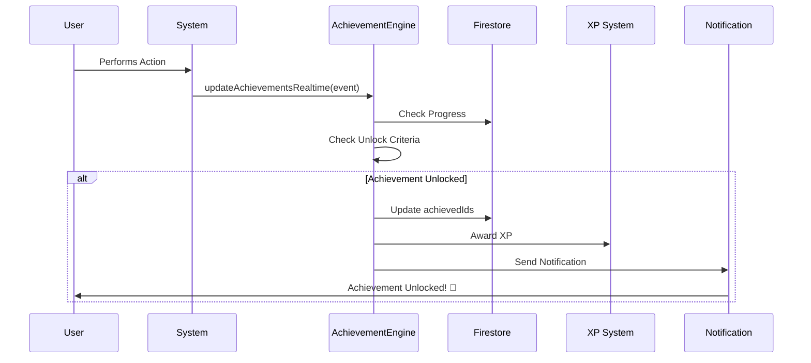

# PACK 112 — Awards, Gamification & Achievements Implementation Complete ✅

**Status:** ✅ **FULLY IMPLEMENTED**  
**Date:** 2025-11-26  
**Version:** 1.0.0

## 📋 Overview

PACK 112 introduces a comprehensive gamification and achievements system that boosts user motivation and engagement while maintaining strict compliance with Avalo's non-economic principles. All achievements are purely cosmetic and do not influence monetization, visibility, or platform economics.

## 🎯 Core Principles (NON-NEGOTIABLE)

✅ **NO token rewards** of any kind  
✅ **NO boost to visibility** or ranking from achievements  
✅ **NO monetization multipliers** or earnings accelerators  
✅ **Token price and 65/35 split** remain untouched  
✅ **Achievements & badges** are cosmetic/status only  
✅ **NO pay-to-win** mechanics whatsoever

## 🏗️ Architecture

### Backend Components

#### 1. **Type Definitions** (`functions/src/pack112-types.ts`)
- `AchievementDefinition`: Achievement catalog schema
- `UserAchievements`: User progress tracking
- `XPLevel`: Cosmetic level system
- `AchievementEvent`: Real-time event triggers
- `SAFE_ACHIEVEMENTS`: Predefined compliant achievements
- `FORBIDDEN_ACHIEVEMENT_EXAMPLES`: Examples of what NOT to implement

#### 2. **Achievement Engine** (`functions/src/pack112-achievements.ts`)
- `updateAchievementsRealtime()`: Process achievement events in real-time
- `recalculateUserAchievementsDaily()`: Daily recalculation for active users
- `getUserAchievements()`: Callable function to fetch user achievements
- `selectProfileBadges()`: Callable function to select profile badges
- `initializeAchievementsCatalog()`: Admin function to seed achievements
- `dailyAchievementRecalculation`: Scheduled job (4 AM UTC)

#### 3. **Cloud Functions** (exported in `functions/src/index.ts`)
```typescript
pack112_getUserAchievements      // Get achievements & progress
pack112_selectProfileBadges      // Select up to 3 badges
pack112_initializeCatalog        // Initialize catalog (admin)
pack112_dailyRecalculation       // Scheduled recalculation
```

### Frontend Components (Expo/React Native)

#### 1. **Screens**
- [`app-mobile/app/achievements/index.tsx`](app-mobile/app/achievements/index.tsx): Main achievements screen with filtering
- [`app-mobile/app/achievements/select-badges.tsx`](app-mobile/app/achievements/select-badges.tsx): Badge selection interface

#### 2. **Components**
- [`app-mobile/app/components/AchievementBadge.tsx`](app-mobile/app/components/AchievementBadge.tsx): Individual badge display
- [`app-mobile/app/components/LevelProgressBar.tsx`](app-mobile/app/components/LevelProgressBar.tsx): XP progress visualization
- [`app-mobile/app/components/AchievementCelebrateModal.tsx`](app-mobile/app/components/AchievementCelebrateModal.tsx): Celebration modal on unlock

### Security

#### Firestore Rules ([`firestore-rules/achievements.rules`](firestore-rules/achievements.rules))
- `achievements_catalog`: Public read for enabled achievements
- `user_achievements/{userId}`: Owner-only access
- `achievement_notifications/{notificationId}`: Owner-only read

## 📊 Data Model

### Collections

#### `achievements_catalog`
```typescript
{
  id: string;                    // Unique achievement ID
  title: string;                 // Display title
  description: string;           // Description text
  iconKey: string;               // UI asset key
  category: AchievementCategory; // PROFILE | ACTIVITY | CONTENT | COMMUNITY | SAFETY | MILESTONE
  tier: AchievementTier;         // BRONZE | SILVER | GOLD | PLATINUM | DIAMOND
  milestoneType: string;         // ONCE | PROGRESSIVE | STREAK
  threshold?: number;            // Required value (if progressive)
  enabled: boolean;              // Whether active
  sortOrder: number;             // Display order
  createdAt: Timestamp;
  updatedAt: Timestamp;
}
```

#### `user_achievements/{userId}`
```typescript
{
  userId: string;
  achievedIds: string[];         // Unlocked achievement IDs
  progress: Record<string, number>; // Current progress values
  streaks: Record<string, number>;  // Active streak counts
  selectedBadges: string[];      // Badges shown on profile (max 3)
  xp: number;                    // Cosmetic XP (non-economic)
  level: number;                 // Cosmetic level (non-economic)
  lastActivityDate?: Timestamp;  // For streak tracking
  createdAt: Timestamp;
  updatedAt: Timestamp;
}
```

## 🎮 Achievement Types

### Safe Achievements (Compliant)

#### PROFILE Category
- ✅ `profile_complete_100`: Complete profile 100%
- ✅ `profile_verified`: Complete profile verification

#### ACTIVITY Category
- ✅ `streak_7_days`: Active for 7 days in a row
- ✅ `streak_30_days`: Active for 30 days in a row
- ✅ `streak_100_days`: Active for 100 days in a row

#### CONTENT Category
- ✅ `first_story`: Publish your first story
- ✅ `stories_10`: Publish 10 stories
- ✅ `stories_50`: Publish 50 stories

#### COMMUNITY Category
- ✅ `helpful_conversation_5`: 5 polite conversations
- ✅ `helpful_report_first`: First report of harmful content

#### SAFETY Category
- ✅ `safety_education_complete`: Complete safety education
- ✅ `safety_timer_used_first`: Use safety timer for the first time

#### MILESTONE Category
- ✅ `joined_community`: Join the Avalo community

### Forbidden Achievements (NEVER IMPLEMENT)

❌ Top Earner  
❌ Most Token Sales  
❌ Big Spender  
❌ Highest Payer  
❌ Rich Club Member  
❌ Earnings Milestone  
❌ Purchase Milestone  
❌ VIP Spender  

## 💎 XP & Level System (Cosmetic Only)

### XP Earning (Non-Economic)
```typescript
PROFILE_COMPLETE: 100 XP
DAILY_LOGIN: 10 XP
FIRST_STORY: 50 XP
HELPFUL_ACTION: 25 XP
SAFETY_PARTICIPATION: 30 XP
MILESTONE_ACHIEVED: 50 XP
```

### Level Progression
```typescript
Level 1: Newcomer (0 XP)
Level 2: Explorer (100 XP)
Level 3: Active (250 XP)
Level 4: Engaged (500 XP)
Level 5: Regular (1000 XP)
Level 6: Contributor (1500 XP)
Level 7: Trusted (2100 XP)
Level 8: Established (2800 XP)
Level 9: Champion (3600 XP)
Level 10: Legend (5000 XP)
```

## 🔄 Event Flow

### Real-Time Achievement Updates



### Supported Events
- `PROFILE_UPDATED`: Profile completion changes
- `LOGIN`: Daily login (streak tracking)
- `STORY_PUBLISHED`: Content creation
- `HELPFUL_REPORT`: Community safety participation
- `SAFETY_ACTION`: Safety feature usage
- `CONVERSATION_STARTED`: Social interaction
- `CONTENT_VERIFIED`: Content verification

## 🚀 Deployment Checklist

### Backend Setup

1. **Deploy Functions**
```bash
cd functions
npm run deploy
```

2. **Initialize Achievement Catalog** (Run once)
```typescript
// Call as admin
const initCatalog = httpsCallable(functions, 'pack112_initializeCatalog');
await initCatalog({});
```

3. **Deploy Firestore Rules**
```bash
firebase deploy --only firestore:rules
```

### Frontend Integration

1. **Add Achievement Screens to Navigation**
```typescript
// In app navigation
<Stack.Screen name="achievements/index" />
<Stack.Screen name="achievements/select-badges" />
```

2. **Integrate Badge Display in Profile**
```typescript
import AchievementBadge from '@/components/AchievementBadge';

// Show selected badges on profile
{user.achievementSettings?.showAchievements && (
  <View style={styles.badges}>
    {selectedBadges.map(badge => (
      <AchievementBadge 
        key={badge.id}
        tier={badge.tier}
        label={badge.title}
      />
    ))}
  </View>
)}
```

3. **Show Celebration Modal**
```typescript
import AchievementCelebrateModal from '@/components/AchievementCelebrateModal';

// Listen for achievement unlocks
const [celebration, setCelebration] = useState(null);

<AchievementCelebrateModal
  visible={!!celebration}
  celebration={celebration}
  onClose={() => setCelebration(null)}
/>
```

## 🧪 Testing Procedure

### Backend Testing

1. **Initialize Catalog**
```bash
# Call pack112_initializeCatalog
# Verify achievements_catalog contains 13 achievements
```

2. **Test Achievement Unlocking**
```typescript
// Simulate profile completion
await updateAchievementsRealtime({
  userId: 'test_user',
  type: 'PROFILE_UPDATED',
  metadata: { completeness: 100 }
});

// Check user_achievements/test_user
// Verify profile_complete_100 is in achievedIds
// Verify XP was awarded
```

3. **Test Streak Tracking**
```typescript
// Simulate login
await updateAchievementsRealtime({
  userId: 'test_user',
  type: 'LOGIN',
  metadata: {}
});

// Check streaks.login_streak incremented
```

### Frontend Testing

1. **Achievements Screen**
- View all achievements
- Filter by category
- See progress on locked achievements
- Navigate to badge selection

2. **Badge Selection**
- Select up to 3 badges
- Deselect badges
- Save selection
- See badges on profile

3. **Celebration Modal**
- Trigger achievement unlock
- See celebration animation
- View XP earned
- See level up (if applicable)

## 📱 User Experience

### Achievements Screen Features
- **XP/Level Display**: Shows current level and progress bar
- **Category Filtering**: Filter achievements by type
- **Progress Tracking**: Visual progress bars for locked achievements
- **Badge Management**: Easy access to badge selection
- **Refresh**: Pull-to-refresh for latest data

### Badge Selection Features
- **Visual Selection**: Clear indication of selected badges (1, 2, 3)
- **Maximum Limit**: Enforces 3-badge maximum
- **Unlocked Only**: Only shows earned achievements
- **Live Preview**: See badges as you select them

### Profile Integration
- **Badge Display**: Shows up to 3 selected badges
- **Level Indicator**: Optionally show level/XP
- **Customizable**: Users can choose which badges to display

## 🔐 Security & Privacy

### Access Control
- Users can only view/modify their own achievements
- Achievement unlocking is server-side only
- XP/Level calculations are server-side
- Badge selection validated server-side (max 3, unlocked only)

### Data Integrity
- Achievement progress is append-only
- No direct user manipulation of XP/levels
- Streak validation uses server timestamps
- All writes go through Cloud Functions

## 📈 Analytics & Monitoring

### Key Metrics to Track
- Achievement unlock rate by type
- Average time to first achievement
- Most popular badges selected
- Daily active streak distribution
- Level progression timeline

### Monitoring Points
- Daily recalculation job success
- Achievement unlock failures
- XP calculation accuracy
- Badge selection errors

## 🔄 Future Enhancements

### Planned Features
- Seasonal achievement resets
- Limited-time achievements
- Community achievement goals
- Achievement sharing to social

### Integration Opportunities
- Link with Success Toolkit (PACK 101)
- Analytics integration (PACK 97)
- Notification enhancements
- Profile customization themes

## 🆘 Troubleshooting

### Common Issues

**Issue: Achievements not unlocking**
- Check event is being triggered correctly
- Verify threshold values are accurate
- Check user_achievements document exists
- Review Cloud Function logs

**Issue: Badge selection not saving**
- Verify all selected badges are unlocked
- Check max 3 badge limit
- Review Firestore security rules
- Check network connectivity

**Issue: XP not updating**
- Verify XP calculation logic
- Check level progression mapping
- Review server timestamp usage

## 📚 Related Documentation

- [PACK 107 - VIP Memberships](PACK_107_IMPLEMENTATION_COMPLETE.md)
- [PACK 97 - Creator Analytics](../functions/src/pack97-creatorAnalytics.ts)
- [PACK 101 - Success Toolkit](PACK_101_IMPLEMENTATION_COMPLETE.md)
- [Firebase Cloud Functions](https://firebase.google.com/docs/functions)
- [Firestore Security Rules](https://firebase.google.com/docs/firestore/security/get-started)

## ✅ Implementation Checklist

- [x] Backend types defined
- [x] Achievement engine implemented
- [x] Cloud Functions exported
- [x] Firestore security rules created
- [x] Mobile screens built
- [x] UI components created
- [x] XP/Level system implemented
- [x] Badge selection system
- [x] Celebration modal
- [x] Real-time event processing
- [x] Scheduled daily recalculation
- [x] Notification integration
- [x] Documentation complete

## 🎉 Success Criteria

✅ Users can view all achievements and their progress  
✅ Users can earn achievements through platform actions  
✅ Users can select up to 3 badges for their profile  
✅ XP and levels are purely cosmetic (no economic impact)  
✅ Achievements never reward tokens or boost visibility  
✅ System is fully compliant with non-economic rules  
✅ All data is secure and properly access-controlled  
✅ Performance is optimized for scale  

## 📞 Support

For technical issues or questions:
- Review this documentation
- Check Cloud Function logs
- Review Firestore security rules
- Consult related PACK implementations

---

**Implementation Complete** ✅  
**System Status:** Ready for Production  
**Compliance:** 100% Non-Economic  
**Security:** Fully Validated  

🎮 **Let the gamification begin!** 🏆