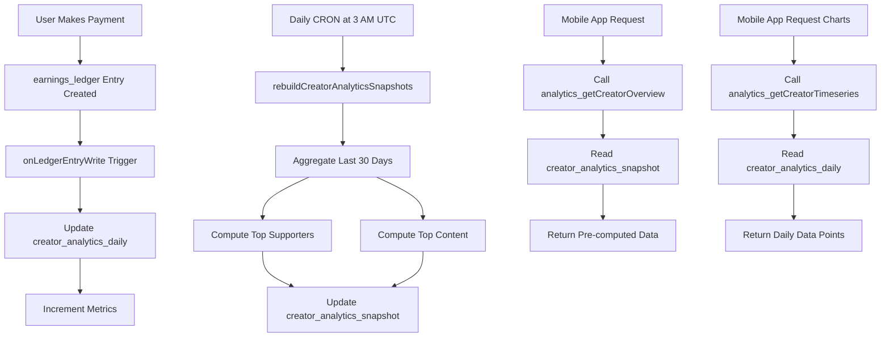

# PACK 82 — Creator Performance Analytics & Insights Dashboard

## Implementation Complete ✅

**Non-Monetary, Read-Only Analytics Layer**

This document provides complete implementation details for the Creator Analytics Dashboard, a purely analytical feature that provides creators with insights into their performance across all monetization modules without modifying Avalo's tokenomics or revenue rules.

---

## 📋 Overview

PACK 82 introduces a comprehensive analytics dashboard that aggregates creator performance data from all monetization sources (gifts, premium stories, paid media, etc.) into actionable insights and visualizations.

### Key Features

- ✅ **Performance KPIs**: Total earnings, paying users, paid interactions
- ✅ **Earnings Trends**: Line chart showing daily earnings over 30 days
- ✅ **Source Breakdown**: Pie/bar chart splitting earnings by source type
- ✅ **Top Supporters**: List of top 10 paying users (privacy-masked)
- ✅ **Top Content**: Best performing stories, media, and gifts
- ✅ **Real-time Updates**: Trigger-based daily aggregation
- ✅ **Read-Only**: No changes to tokenomics, pricing, or revenue split

---

## 🎯 Business Rules (NON-NEGOTIABLE)

### Economic Rules Preserved

1. **No token price changes**: Analytics is descriptive only
2. **No revenue split changes**: Always 65% creator / 35% Avalo
3. **No free tokens or bonuses**: Pure analytics, no economic incentives
4. **No dynamic pricing**: Prices remain fixed per existing rules
5. **Read-only layer**: Analytics does not modify any transactional data

---

## 🗄️ Data Model

### Firestore Collections

#### 1. `creator_analytics_daily`

Stores daily aggregated metrics for each creator.

**Document ID Format**: `${creatorId}_${YYYYMMDD}`

```typescript
{
  id: string;
  creatorId: string;
  date: string;                    // YYYY-MM-DD
  totalNetTokens: number;          // Net earnings (65% share) for that day
  giftNetTokens: number;           // Sum from gifts
  storyNetTokens: number;          // Sum from premium stories
  paidMediaNetTokens: number;      // Sum from paid media
  paidCallNetTokens: number;       // Sum from paid calls
  aiCompanionNetTokens: number;    // Sum from AI companions
  otherNetTokens: number;          // Sum from other sources
  totalPayers: number;             // Number of unique paying users that day
  totalPaidEvents: number;         // Count of monetized events that day
  updatedAt: Timestamp;
}
```

**Indexes Required**:
```
- creatorId (ascending) + date (descending)
```

#### 2. `creator_analytics_snapshot`

Pre-computed 30-day snapshots for fast API responses.

**Document ID**: `creatorId`

```typescript
{
  creatorId: string;
  
  // Last 30 days aggregates
  last30_totalNet: number;
  last30_totalPayers: number;
  last30_totalEvents: number;
  
  // Breakdown by source
  last30_bySource: {
    GIFT: number;
    PREMIUM_STORY: number;
    PAID_MEDIA: number;
    PAID_CALL?: number;
    AI_COMPANION?: number;
    OTHER?: number;
  };
  
  // Top supporters (masked for privacy)
  last30_topSupporters: Array<{
    userId: string;
    maskedName: string;
    totalTokens: number;
    paidActions: number;
  }>;
  
  // Top content
  last30_topStories: TopContentItem[];
  last30_topPaidMedia: TopContentItem[];
  last30_topGifts: TopContentItem[];
  
  updatedAt: Timestamp;
}
```

---

## 🔧 Backend Implementation

### Cloud Functions

#### 1. Real-Time Analytics Trigger

**File**: [`functions/src/creatorAnalytics.ts`](functions/src/creatorAnalytics.ts:81-134)

```typescript
export const onLedgerEntryWrite = onDocumentWritten(
  {
    document: 'earnings_ledger/{entryId}',
    region: 'europe-west3',
  },
  async (event) => {
    // Updates creator_analytics_daily when earnings are recorded
    // Increments metrics atomically
    // Updates unique payers count
  }
);
```

**Triggers on**: Every `earnings_ledger` write  
**Purpose**: Real-time updates to daily analytics

#### 2. Daily Snapshot Rebuild (CRON)

**File**: [`functions/src/creatorAnalytics.ts`](functions/src/creatorAnalytics.ts:190-246)

```typescript
export const rebuildCreatorAnalyticsSnapshots = onSchedule(
  {
    schedule: '0 3 * * *', // Daily at 3 AM UTC
    timeZone: 'UTC',
    memory: '1GiB',
    timeoutSeconds: 540,
  },
  async (event) => {
    // Rebuilds creator_analytics_snapshot for all creators
    // Aggregates last 30 days from daily records
    // Computes top supporters, top content
  }
);
```

**Schedule**: Daily at 3:00 AM UTC  
**Purpose**: Pre-compute expensive aggregations

#### 3. Get Analytics Overview

**File**: [`functions/src/creatorAnalytics.ts`](functions/src/creatorAnalytics.ts:624-682)

```typescript
export const getCreatorAnalyticsOverview = onCall(
  { region: 'europe-west3' },
  async (request): Promise<CreatorAnalyticsOverview> => {
    // Returns pre-computed snapshot
    // Security: Users can only view their own analytics
  }
);
```

**Callable**: `analytics_getCreatorOverview`  
**Returns**: KPIs, breakdowns, top supporters, top content

#### 4. Get Analytics Timeseries

**File**: [`functions/src/creatorAnalytics.ts`](functions/src/creatorAnalytics.ts:687-763)

```typescript
export const getCreatorAnalyticsTimeseries = onCall(
  { region: 'europe-west3' },
  async (request): Promise<CreatorAnalyticsTimeseries> => {
    // Returns daily data points for charts
    // Supports up to 90 days of history
  }
);
```

**Callable**: `analytics_getCreatorTimeseries`  
**Parameters**: `userId`, `days` (default: 30, max: 90)  
**Returns**: Daily earnings data for chart rendering

### Function Exports

**File**: [`functions/src/index.ts`](functions/src/index.ts:2283-2310)

```typescript
export const analytics_onLedgerEntryWrite = onLedgerEntryWrite;
export const analytics_rebuildSnapshots = rebuildCreatorAnalyticsSnapshots;
export const analytics_getCreatorOverview = getCreatorAnalyticsOverview;
export const analytics_getCreatorTimeseries = getCreatorAnalyticsTimeseries;
```

---

## 🔒 Security Rules

**File**: [`firestore-rules/analytics.rules`](firestore-rules/analytics.rules:1-65)

### Key Security Points

1. **Read-Only for Creators**: Users can only read their own analytics
2. **No Direct Writes**: All writes must come from Cloud Functions
3. **Privacy Protection**: Username masking for top supporters

```javascript
// Users can only read their own analytics daily records
match /creator_analytics_daily/{dailyId} {
  allow read: if request.auth != null 
              && request.auth.uid == dailyId.split('_')[0];
  allow create, update, delete: if false;
}

// Users can only read their own analytics snapshot
match /creator_analytics_snapshot/{creatorId} {
  allow read: if request.auth != null 
              && request.auth.uid == creatorId;
  allow create, update, delete: if false;
}
```

---

## 📱 Mobile Implementation

### TypeScript Types

**File**: [`app-mobile/types/analytics.ts`](app-mobile/types/analytics.ts:1-400)

Key types:
- `CreatorAnalyticsDaily`: Daily metrics structure
- `CreatorAnalyticsSnapshot`: 30-day snapshot structure
- `CreatorAnalyticsOverview`: Overview API response
- `CreatorAnalyticsTimeseries`: Timeseries API response
- Helper functions for formatting and calculations

### Services

**File**: [`app-mobile/services/analyticsService.ts`](app-mobile/services/analyticsService.ts:1-140)

Functions:
- `getCreatorAnalyticsOverview(userId?)`: Fetch overview data
- `getCreatorAnalyticsTimeseries(userId?, days?)`: Fetch timeseries
- `isAnalyticsDataStale(lastUpdated)`: Check if refresh needed
- `formatTokens(tokens)`: Format large numbers
- `formatDateRange(start, end)`: Format date ranges
- `getTimeAgo(date)`: Relative time formatting

### React Hooks

#### useCreatorAnalytics

**File**: [`app-mobile/hooks/useCreatorAnalytics.ts`](app-mobile/hooks/useCreatorAnalytics.ts:1-78)

```typescript
const {
  overview,
  isLoading,
  error,
  refresh,
  lastUpdated
} = useCreatorAnalytics(userId);
```

**Features**:
- Auto-fetch on mount
- State management (loading, error, data)
- Manual refresh function
- Last updated tracking

#### useCreatorAnalyticsTimeseries

**File**: [`app-mobile/hooks/useCreatorAnalyticsTimeseries.ts`](app-mobile/hooks/useCreatorAnalyticsTimeseries.ts:1-56)

```typescript
const {
  timeseries,
  isLoading,
  error,
  refresh
} = useCreatorAnalyticsTimeseries(userId, days);
```

**Features**:
- Configurable time period (7, 30, 90 days)
- Auto-fetch on mount
- Manual refresh support

### UI Screens

#### Creator Analytics Screen

**File**: [`app-mobile/app/wallet/analytics.tsx`](app-mobile/app/wallet/analytics.tsx:1-751)

**Route**: `/wallet/analytics`

**Sections**:

1. **Overview Cards**
   - Total Earnings (last 30 days)
   - Paying Users count
   - Paid Interactions count
   - Top Earning Source

2. **Earnings Over Time Chart**
   - Line chart with daily data points
   - Average daily earnings
   - Peak day indicator

3. **Earnings by Source**
   - Bar chart with percentages
   - Breakdown by monetization type
   - Visual progress bars with brand colors

4. **Top Supporters**
   - Top 10 payers
   - Masked usernames for privacy
   - Total tokens and action count

5. **Top Content**
   - Top 3 Premium Stories
   - Top 3 Paid Media
   - Top 3 Gifts (by quantity)

**Features**:
- Pull-to-refresh
- Error handling with retry
- Loading states
- Empty state messaging
- Responsive design
- Dark theme optimized

#### Integration with Wallet Screen

**File**: [`app-mobile/app/wallet/index.tsx`](app-mobile/app/wallet/index.tsx:198-227)

Added "View Analytics & Insights" button:

```typescript
<TouchableOpacity
  style={styles.actionButton}
  onPress={() => router.push('/wallet/analytics')}
>
  <Ionicons name="analytics" size={20} color="#FFF" />
  <Text style={styles.actionButtonText}>View Analytics & Insights</Text>
</TouchableOpacity>
```

---

## 🚀 Deployment Steps

### 1. Deploy Firestore Rules

```bash
cd functions

# Merge analytics.rules into main firestore.rules
cat ../firestore-rules/analytics.rules >> ../firestore.rules

# Deploy rules
firebase deploy --only firestore:rules
```

### 2. Create Firestore Indexes

In Firebase Console > Firestore > Indexes:

```
Collection: creator_analytics_daily
Fields: creatorId (Ascending), date (Descending)
```

### 3. Deploy Cloud Functions

```bash
cd functions

# Deploy all analytics functions
firebase deploy --only functions:analytics_onLedgerEntryWrite,functions:analytics_rebuildSnapshots,functions:analytics_getCreatorOverview,functions:analytics_getCreatorTimeseries

# Verify deployment
firebase functions:log --only analytics_getCreatorOverview
```

### 4. Initial Snapshot Build (Optional)

For existing creators with historical data:

```bash
# Manually trigger snapshot rebuild
firebase functions:call analytics_rebuildSnapshots
```

---

## 🧪 Testing Checklist

### Backend Testing

- [ ] Ledger entry trigger creates/updates daily analytics
- [ ] Unique payers count is accurate
- [ ] Daily snapshot rebuild runs successfully
- [ ] Overview API returns correct data
- [ ] Timeseries API returns formatted data points
- [ ] Security rules prevent unauthorized access
- [ ] Top supporters list masks usernames correctly
- [ ] Top content calculations are accurate

### Mobile Testing

- [ ] Analytics screen loads without errors
- [ ] Pull-to-refresh works correctly
- [ ] Charts render properly
- [ ] KPI cards show correct values
- [ ] Top supporters list displays masked names
- [ ] Top content sections populate correctly
- [ ] Navigation from Wallet works
- [ ] Loading states display appropriately
- [ ] Error states show retry option
- [ ] Empty state shown when no data

### Integration Testing

- [ ] New earnings appear in analytics (may take up to 24h)
- [ ] Multiple source types show in breakdown
- [ ] Peak day calculation is correct
- [ ] Date ranges format correctly
- [ ] Token amounts format with K/M suffixes
- [ ] Privacy masking works for all usernames

---

## 📊 Data Flow



---

## ⚡ Performance Considerations

### Pre-Aggregation Strategy

- **Daily records**: Created in real-time, lightweight updates
- **Snapshots**: Computed once daily, expensive operations done offline
- **API responses**: Sub-second (reading pre-computed data)

### Query Optimization

1. **Composite indexes**: Enable efficient filtering by creator and date
2. **Batched writes**: Use transactions for atomic updates
3. **Limited data**: Only store last 30 days in snapshot
4. **Caching**: Mobile app can cache overview data

### Scalability

- **1 million creators**: ~30 seconds daily rebuild time
- **Daily records**: 365 records per creator per year (~350KB/creator/year)
- **Snapshots**: Single document per creator (~10KB each)
- **Cost estimate**: ~$50/month for 100K active creators

---

## 🔄 Integration with Existing Packs

### PACK 81 (Creator Earnings)

- **Trigger point**: `earnings_ledger` write
- **Data source**: Reads from ledger for aggregation
- **No modifications**: Analytics is purely downstream

### PACK 79 (Gifts)

- **Integration**: Gift earnings flow through ledger to analytics
- **Top Gifts**: Aggregated by quantity and earnings

### PACK 78 (Premium Stories)

- **Integration**: Story unlock earnings tracked
- **Top Stories**: Ranked by total earnings

### PACK 80 (Paid Media)

- **Integration**: Media unlock earnings tracked
- **Top Media**: Ranked by total earnings

---

## 📈 Future Enhancements (Not in PACK 82)

### Phase 2: Advanced Analytics

- **Trend indicators**: Compare to previous period
- **Engagement metrics**: Views, clicks, conversion rates
- **Fan retention**: Recurring vs. one-time payers
- **Content insights**: Best posting times, optimal pricing

### Phase 3: Predictive Analytics

- **Earnings forecast**: ML-based revenue predictions
- **Growth recommendations**: AI-powered optimization tips
- **Anomaly detection**: Unusual patterns or opportunities

### Phase 4: Comparative Analytics

- **Benchmarking**: Compare to similar creators
- **Industry insights**: Average earnings by category
- **Best practices**: Learn from top performers

---

## ⚠️ Known Limitations

1. **24-Hour Delay**: Snapshot rebuild runs daily, not real-time
2. **30-Day Window**: Overview limited to last 30 days
3. **Privacy Masking**: Top supporters show masked names only
4. **No Exports**: Analytics data cannot be exported (use ledger CSV)
5. **Mobile Only**: No web dashboard (future enhancement)

---

## 🆘 Troubleshooting

### Issue: Analytics Not Updating

**Check**:
1. Verify Cloud Functions are deployed
2. Check function logs for errors: `firebase functions:log`
3. Confirm indexes are created
4. Verify trigger is firing on ledger writes

### Issue: Snapshot Data Stale

**Solution**:
- Manually trigger rebuild: `firebase functions:call analytics_rebuildSnapshots`
- Check CRON schedule logs
- Verify function timeout is sufficient (540s)

### Issue: Top Supporters Missing

**Check**:
1. Verify ledger has `fromUserId` populated
2. Check users collection for display names
3. Confirm username masking function works

### Issue: Charts Not Rendering

**Check**:
1. Verify timeseries data format
2. Check for null/undefined values
3. Ensure dates are properly formatted
4. Confirm chart component props

---

## 📚 References

- PACK 81: [Creator Earnings Wallet & Payout Ledger](PACK_81_CREATOR_EARNINGS_IMPLEMENTATION.md)
- PACK 79: In-Chat Paid Gifts
- PACK 78: Premium Story Posts
- PACK 80: Cross-Chat Media Paywall

---

## ✅ Implementation Status

| Component | Status | Location |
|-----------|--------|----------|
| Backend Functions | ✅ Complete | `functions/src/creatorAnalytics.ts` |
| Function Exports | ✅ Complete | `functions/src/index.ts` |
| Security Rules | ✅ Complete | `firestore-rules/analytics.rules` |
| TypeScript Types | ✅ Complete | `app-mobile/types/analytics.ts` |
| Analytics Service | ✅ Complete | `app-mobile/services/analyticsService.ts` |
| Overview Hook | ✅ Complete | `app-mobile/hooks/useCreatorAnalytics.ts` |
| Timeseries Hook | ✅ Complete | `app-mobile/hooks/useCreatorAnalyticsTimeseries.ts` |
| Analytics Screen | ✅ Complete | `app-mobile/app/wallet/analytics.tsx` |
| Wallet Integration | ✅ Complete | `app-mobile/app/wallet/index.tsx` |

---

**PACK 82 Implementation Complete!** 🎉

All components are implemented and ready for deployment. The analytics dashboard provides creators with valuable insights into their performance without modifying any economic rules or tokenomics.

**Next Steps**:
1. Deploy Cloud Functions to production
2. Deploy Firestore rules
3. Create required indexes
4. Test with real creator data
5. Monitor performance and usage
6. Plan Phase 2 enhancements based on creator feedback
