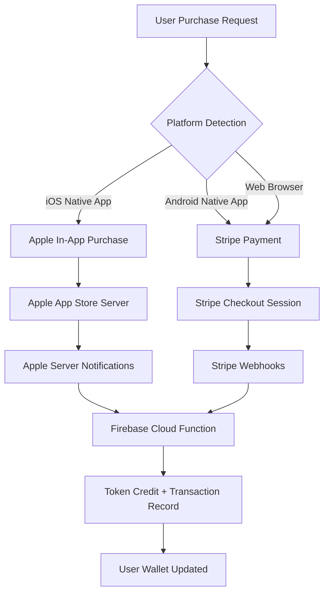

# AVALO DUAL-PATH PAYMENTS ARCHITECTURE BLUEPRINT
**Version:** 1.0  
**Role:** Payments Architect  
**Mode:** READ-ONLY SPECIFICATION  
**Date:** 2025-11-09

---

## TABLE OF CONTENTS

1. [Executive Summary](#1-executive-summary)
2. [Dual-Path Architecture Overview](#2-dual-path-architecture-overview)
3. [App Store Guideline 3.1.1 Compliance Matrix](#3-app-store-guideline-311-compliance-matrix)
4. [Database Schema & Collections](#4-database-schema--collections)
5. [Payment Flow Sequences](#5-payment-flow-sequences)
6. [Idempotency & Retry Safety](#6-idempotency--retry-safety)
7. [Commission Splits & Escrow](#7-commission-splits--escrow)
8. [Settlement & Payout Flows](#8-settlement--payout-flows)
9. [VAT Calculation Engine](#9-vat-calculation-engine)
10. [Webhook Handlers](#10-webhook-handlers)
11. [API Specifications](#11-api-specifications)
12. [Security & Fraud Prevention](#12-security--fraud-prevention)
13. [Error Handling & Recovery](#13-error-handling--recovery)
14. [Monitoring & Observability](#14-monitoring--observability)
15. [Migration Strategy](#15-migration-strategy)

---

## 1. EXECUTIVE SUMMARY

### 1.1 Architecture Goals

**Primary Objectives:**
- ✅ **Dual-Path Payments**: iOS uses Apple IAP exclusively; Android/Web uses Stripe
- ✅ **App Store Compliance**: Full adherence to Guideline 3.1.1
- ✅ **Idempotency**: Zero duplicate charges across all payment flows
- ✅ **Retry Safety**: Automatic recovery from network/service failures
- ✅ **Transparent Accounting**: Real-time settlement, escrow tracking
- ✅ **VAT Compliance**: Automated calculation for EU/global markets
- ✅ **Creator Payouts**: Multi-currency, multi-method settlements

### 1.2 Token Economics

```
1 Token = 0.20 PLN (Settlement Rate - Fixed)
Display prices vary by market (USD, EUR, GBP show fiat equivalent)
```

**Token Packs:**
| Pack | Tokens | PLN | USD | EUR | GBP |
|------|--------|-----|-----|-----|-----|
| MINI | 100 | 20 | 5.49 | 4.99 | 4.49 |
| BASIC | 300 | 60 | 15.99 | 14.99 | 12.99 |
| STANDARD | 500 | 100 | 26.99 | 24.99 | 21.99 |
| PREMIUM | 1000 | 200 | 52.99 | 49.99 | 43.99 |
| PRO | 2000 | 400 | 104.99 | 99.99 | 87.99 |
| ELITE | 5000 | 1000 | 259.99 | 249.99 | 219.99 |

---

## 2. DUAL-PATH ARCHITECTURE OVERVIEW

### 2.1 Platform-Based Payment Routing



### 2.2 Payment Provider Configuration

#### iOS (Apple IAP)
```typescript
{
  provider: 'apple_iap',
  products: [
    { id: 'avalo.tokens.mini.100', tokens: 100 },
    { id: 'avalo.tokens.basic.300', tokens: 300 },
    { id: 'avalo.tokens.standard.500', tokens: 500 },
    { id: 'avalo.tokens.premium.1000', tokens: 1000 },
    { id: 'avalo.tokens.pro.2000', tokens: 2000 },
    { id: 'avalo.tokens.elite.5000', tokens: 5000 }
  ],
  subscriptions: [
    { id: 'avalo.royal.monthly', period: 'P1M' },
    { id: 'avalo.royal.annual', period: 'P1Y' }
  ],
  sharedSecret: process.env.APPLE_SHARED_SECRET,
  serverNotificationUrl: 'https://us-central1-avalo.cloudfunctions.net/appleWebhook'
}
```

#### Android/Web (Stripe)
```typescript
{
  provider: 'stripe',
  secretKey: process.env.STRIPE_SECRET_KEY,
  webhookSecret: process.env.STRIPE_WEBHOOK_SECRET,
  publicKey: process.env.STRIPE_PUBLIC_KEY,
  accountId: process.env.STRIPE_ACCOUNT_ID,
  apiVersion: '2024-11-20.acacia',
  successUrl: '{ORIGIN}/wallet?payment=success&session_id={CHECKOUT_SESSION_ID}',
  cancelUrl: '{ORIGIN}/wallet?payment=cancelled'
}
```

---

## 3. APP STORE GUIDELINE 3.1.1 COMPLIANCE MATRIX

### 3.1 Guideline Summary

**Apple App Store Review Guidelines 3.1.1:**
> Apps offering digital goods or services for use within the app MUST use Apple's In-App Purchase.

### 3.2 Compliance Table

| Item | Type | iOS Implementation | Web/Android Implementation | Compliant |
|------|------|-------------------|---------------------------|-----------|
| **Token Purchases** | Digital Currency | ✅ Apple IAP only | ✅ Stripe | ✅ YES |
| **Royal Club Subscription** | Auto-Renewable | ✅ Apple IAP Subscription | ✅ Stripe Subscription | ✅ YES |
| **Chat Unlocks** | Consumable | ✅ Tokens (via IAP) | ✅ Tokens (via Stripe) | ✅ YES |
| **Video Unlocks** | Consumable | ✅ Tokens (via IAP) | ✅ Tokens (via Stripe) | ✅ YES |
| **Tips to Creators** | Consumable | ✅ Tokens (via IAP) | ✅ Tokens (via Stripe) | ✅ YES |
| **Calendar Bookings** | Service | ✅ Tokens (via IAP) | ✅ Tokens (via Stripe) | ✅ YES |
| **Creator Payouts** | Physical Good/Service | ⚠️ NOT via IAP (External) | ⚠️ NOT via IAP (External) | ✅ YES |
| **External Links** | Reader App Exception | ❌ No external payment links | ✅ Stripe links allowed | ✅ YES |

### 3.3 Implementation Rules

**✅ DO:**
- Use Apple IAP for ALL in-app digital purchases on iOS
- Display prices in user's local currency via StoreKit
- Handle subscription renewals via Apple server notifications
- Restore purchases via Apple receipt validation
- Credit tokens ONLY after Apple verification

**❌ DON'T:**
- Show Stripe payment UI in iOS app
- Link to external payment pages from iOS app
- Display fiat prices for tokens in iOS app
- Accept PayPal, crypto, or other payment methods in iOS app
- Bypass IAP using "reader app" exception (not applicable)

### 3.4 Token Purchase Flow Comparison

#### iOS Flow (Compliant)
```
User clicks "Buy 500 Tokens" 
→ StoreKit presents Apple payment sheet
→ User completes purchase via Face ID/Touch ID
→ Apple charges their iTunes account
→ Apple sends server notification to our webhook
→ We credit 500 tokens to user wallet
→ User sees updated balance
```

#### Android/Web Flow (Compliant)
```
User clicks "Buy 500 Tokens"
→ Stripe Checkout session created
→ Redirect to Stripe hosted page
→ User completes payment via card/wallet
→ Stripe webhook confirms payment
→ We credit 500 tokens to user wallet
→ User redirected back with success
```

---

## 4. DATABASE SCHEMA & COLLECTIONS

### 4.1 Core Payment Collections

#### `/paymentSessions/{sessionId}`
```typescript
interface PaymentSession {
  // Identity
  sessionId: string;                    // Unique session identifier
  userId: string;                       // User making purchase
  
  // Provider routing
  provider: 'apple_iap' | 'stripe' | 'przelewy24' | 'payu' | 'coinbase';
  platform: 'ios' | 'android' | 'web';
  
  // Purchase details
  productType: 'tokens' | 'subscription' | 'unlock';
  tokens?: number;                      // Tokens to credit (if applicable)
  amount: number;                       // Money amount
  currency: string;                     // ISO 4217 code (USD, EUR, PLN)
  
  // External provider IDs
  providerSessionId: string;            // Stripe session_id or Apple transaction_id
  providerProductId?: string;           // apple_iap: com.avalo.tokens.500
  
  // Status tracking
  status: 'pending' | 'processing' | 'completed' | 'failed' | 'cancelled' | 'refunded';
  
  // Idempotency
  idempotencyKey: string;               // Unique key for deduplication
  webhookProcessedAt?: Timestamp;
  webhookAttempts: number;
  
  // Metadata
  metadata: {
    userAgent?: string;
    ipAddress?: string;
    deviceId?: string;
    appVersion?: string;
  };
  
  // Timestamps
  createdAt: Timestamp;
  updatedAt: Timestamp;
  completedAt?: Timestamp;
  expiresAt?: Timestamp;                // for pending sessions (30 min)
}
```

**Indexes:**
```javascript
// Firestore indexes
{
  fields: [
    { fieldPath: 'userId', order: 'ASCENDING' },
    { fieldPath: 'createdAt', order: 'DESCENDING' }
  ]
},
{
  fields: [
    { fieldPath: 'providerSessionId', order: 'ASCENDING' },
    { fieldPath: 'provider', order: 'ASCENDING' }
  ]
},
{
  fields: [
    { fieldPath: 'status', order: 'ASCENDING' },
    { fieldPath: 'createdAt', order: 'DESCENDING' }
  ]
}
```

---

#### `/transactions/{txId}`
```typescript
interface Transaction {
  // Identity
  txId: string;                         // tx_{provider}_{timestamp}_{random}
  userId: string;
  
  // Transaction type
  type: 'deposit' | 'earning' | 'spending' | 'refund' | 'settlement' | 'escrow_hold' | 'escrow_release';
  subtype?: 'token_purchase' | 'chat_fee' | 'video_fee' | 'calendar_fee' | 'tip' | 'subscription';
  
  // Amounts
  tokens: number;                       // Token amount (positive or negative)
  fiatAmount?: number;                  // Fiat equivalent (for accounting)
  fiatCurrency?: string;
  
  // Provider details
  provider?: 'apple_iap' | 'stripe' | 'internal';
  providerTxId?: string;                // External transaction ID
  paymentSessionId?: string;            // Link to paymentSession
  
  // Escrow tracking (for earnings)
  escrowStatus?: 'held' | 'released' | 'refunded';
  escrowReleaseAt?: Timestamp;
  
  // Related entities
  relatedUserId?: string;               // For peer-to-peer transactions
  relatedChatId?: string;
  relatedPostId?: string;
  relatedBookingId?: string;
  
  // Commission splits (for earnings)
  splits?: {
    platformFee: number;                // Avalo's cut (in tokens)
    platformFeePercent: number;         // Percentage (20-35%)
    creatorAmount: number;              // Creator's cut (in tokens)
    creatorPercent: number;             // Percentage (65-80%)
  };
  
  // Accounting
  balanceBefore: number;                // User's balance before tx
  balanceAfter: number;                 // User's balance after tx
  
  // Status
  status: 'pending' | 'completed' | 'failed' | 'reversed';
  
  // Metadata
  description: string;
  metadata: Record<string, any>;
  
  // Timestamps
  createdAt: Timestamp;
  completedAt?: Timestamp;
}
```

**Indexes:**
```javascript
{
  fields: [
    { fieldPath: 'userId', order: 'ASCENDING' },
    { fieldPath: 'type', order: 'ASCENDING' },
    { fieldPath: 'createdAt', order: 'DESCENDING' }
  ]
},
{
  fields: [
    { fieldPath: 'relatedChatId', order: 'ASCENDING' },
    { fieldPath: 'createdAt', order: 'DESCENDING' }
  ]
},
{
  fields: [
    { fieldPath: 'escrowStatus', order: 'ASCENDING' },
    { fieldPath: 'escrowReleaseAt', order: 'ASCENDING' }
  ]
}
```

---

#### `/users/{userId}/wallet`
```typescript
interface UserWallet {
  userId: string;
  
  // Balance tracking
  balance: number;                      // Available tokens
  pendingBalance: number;               // Tokens held in escrow
  earnedBalance: number;                // Lifetime earnings (for creators)
  spentBalance: number;                 // Lifetime spending
  
  // Provider integrations
  stripeCustomerId?: string;
  appleCustomerId?: string;             // For subscription tracking
  
  // Currency preferences
  preferredCurrency: string;            // User's fiat display preference
  
  // Payment methods (Stripe)
  paymentMethods: Array<{
    id: string;
    type: 'card' | 'sepa_debit' | 'paypal';
    brand?: string;
    last4?: string;
    expiryMonth?: number;
    expiryYear?: number;
    isDefault: boolean;
  }>;
  
  // Stats
  totalDeposits: number;                // Total tokens purchased
  totalEarnings: number;                // Total tokens earned (creators)
  totalSpending: number;                // Total tokens spent
  totalRefunds: number;                 // Total tokens refunded
  
  // Timestamps
  createdAt: Timestamp;
  updatedAt: Timestamp;
}
```

---

#### `/escrow/{escrowId}`
```typescript
interface EscrowRecord {
  escrowId: string;                     // esc_{chatId|bookingId}_{timestamp}
  
  // Parties
  payerId: string;                      // User who paid
  recipientId: string;                  // User who will earn
  
  // Type
  type: 'chat' | 'booking' | 'unlock';
  relatedId: string;                    // chatId, bookingId, postId
  
  // Amounts
  totalTokens: number;                  // Total tokens held
  platformFee: number;                  // Avalo's cut (deducted immediately)
  availableTokens: number;              // Tokens available for release
  consumedTokens: number;               // Tokens already released to recipient
  
  // Status
  status: 'active' | 'completed' | 'refunded' | 'expired';
  
  // Release conditions
  releaseType: 'incremental' | 'milestone' | 'time-based';
  autoReleaseAt?: Timestamp;            // Auto-release date (48h for chats)
  
  // Refund tracking
  refundEligible: boolean;
  refundReason?: string;
  refundedAt?: Timestamp;
  refundedAmount?: number;
  
  // Timestamps
  createdAt: Timestamp;
  updatedAt: Timestamp;
  completedAt?: Timestamp;
}
```

**Indexes:**
```javascript
{
  fields: [
    { fieldPath: 'status', order: 'ASCENDING' },
    { fieldPath: 'autoReleaseAt', order: 'ASCENDING' }
  ]
},
{
  fields: [
    { fieldPath: 'recipientId', order: 'ASCENDING' },
    { fieldPath: 'status', order: 'ASCENDING' }
  ]
}
```

---

#### `/settlements/{settlementId}`
```typescript
interface Settlement {
  settlementId: string;                 // stl_{creatorId}_{period}
  
  // Creator details
  creatorId: string;
  creatorEmail: string;
  
  // Period
  periodStart: Timestamp;
  periodEnd: Timestamp;
  periodLabel: string;                  // "2024-11" for monthly
  
  // Amounts
  totalTokensEarned: number;            // Gross tokens earned in period
  platformFeesDeducted: number;         // Avalo's cut
  netTokensPayable: number;             // Net tokens for payout
  
  // Fiat conversion
  settlementRate: number;               // Tokens to fiat rate (0.20 PLN)
  fiatAmount: number;                   // Net tokens × settlement rate
  fiatCurrency: string;                 // PLN, USD, EUR
  
  // VAT
  vatApplicable: boolean;
  vatRate: number;                      // 23% for Poland, varies by country
  vatAmount: number;
  grossAmount: number;                  // fiatAmount + vatAmount
  
  // Payout method
  payoutMethod: 'sepa' | 'ach' | 'paypal' | 'crypto' | 'wise';
  payoutDestination: string;            // IBAN, PayPal email, wallet address
  
  // Status
  status: 'pending' | 'processing' | 'paid' | 'failed' | 'disputed';
  
  // Provider tracking
  payoutProviderId?: string;            // Stripe payout ID
  payoutReference?: string;
  
  // Transaction breakdown
  transactionIds: string[];             // All transaction IDs included
  
  // Timestamps
  createdAt: Timestamp;
  processedAt?: Timestamp;
  paidAt?: Timestamp;
}
```

**Indexes:**
```javascript
{
  fields: [
    { fieldPath: 'creatorId', order: 'ASCENDING' },
    { fieldPath: 'periodStart', order: 'DESCENDING' }
  ]
},
{
  fields: [
    { fieldPath: 'status', order: 'ASCENDING' },
    { fieldPath: 'createdAt', order: 'ASCENDING' }
  ]
}
```

---

#### `/subscriptions/{subscriptionId}`
```typescript
interface Subscription {
  subscriptionId: string;
  
  // Parties
  userId: string;                       // Subscriber
  creatorId?: string;                   // For creator subscriptions
  
  // Type
  type: 'royal_club' | 'creator_tier';
  tierId?: string;                      // For creator tiers
  
  // Pricing
  tokens: number;                       // Token cost per period
  fiatAmount?: number;                  // Fiat amount (IAP/Stripe)
  currency?: string;
  period: 'monthly' | 'annual';
  
  // Provider
  provider: 'apple_iap' | 'stripe';
  providerSubscriptionId: string;       // Apple original_transaction_id or Stripe sub_id
  providerProductId: string;            // IAP product ID or Stripe price ID
  
  // Status
  status: 'active' | 'cancelled' | 'expired' | 'past_due' | 'paused';
  cancelAtPeriodEnd: boolean;
  
  // Dates
  currentPeriodStart: Timestamp;
  currentPeriodEnd: Timestamp;
  cancelledAt?: Timestamp;
  
  // Webhooks
  lastWebhookAt?: Timestamp;
  
  // Timestamps
  createdAt: Timestamp;
  updatedAt: Timestamp;
}
```

---

## 5. PAYMENT FLOW SEQUENCES

### 5.1 iOS Token Purchase Flow

```
┌─────────┐          ┌──────────┐          ┌───────────┐          ┌──────────┐
│ iOS App │          │ StoreKit │          │   Apple   │          │ Firebase │
└────┬────┘          └────┬─────┘          └─────┬─────┘          └────┬─────┘
     │                    │                      │                      │
     │ 1. Request product│                      │                      │
     │ SKProductsRequest │                      │                      │
     ├──────────────────>│                      │                      │
     │                    │                      │                      │
     │ 2. Products        │                      │                      │
     │<──────────────────┤                      │                      │
     │                    │                      │                      │
     │ 3. User taps "Buy" │                      │                      │
     │ SKPayment.add()    │                      │                      │
     ├──────────────────>│                      │                      │
     │                    │                      │                      │
     │                    │ 4. Process payment   │                      │
     │                    ├─────────────────────>│                      │
     │                    │                      │                      │
     │                    │ 5. Payment completed │                      │
     │                    │<─────────────────────┤                      │
     │                    │                      │                      │
     │ 6. Transaction     │                      │                      │
     │<──────────────────┤                      │                      │
     │                    │                      │                      │
     │ 7. Validate receipt│                      │                      │
     │ Cloud Function     │                      │                      │
     ├────────────────────┼──────────────────────┼─────────────────────>│
     │                    │                      │                      │
     │                    │                      │ 8. Verify receipt    │
     │                    │                      │<─────────────────────┤
     │                    │                      │                      │
     │                    │                      │ 9. Receipt valid     │
     │                    │                      ├─────────────────────>│
     │                    │                      │                      │
     │                    │                      │ 10. Credit tokens    │
     │                    │                      │ Create transaction   │
     │                    │                      │ Update wallet        │
     │                    │                      │      (atomic)         │
     │                    │                      │                      │
     │ 11. Success        │                      │                      │
     │<───────────────────┼──────────────────────┼──────────────────────┤
     │                    │                      │                      │
     │ 12. Finish tx      │                      │                      │
     │ SKPaymentQueue     │                      │                      │
     ├──────────────────>│                      │                      │
     │                    │                      │                      │
     │                    │                      │ 13. Server webhook   │
     │                    │                      ├─────────────────────>│
     │                    │                      │ (async confirmation) │
     │                    │                      │                      │
```

**Implementation:**
```typescript
// iOS client-side (React Native)
import { purchaseProduct } from 'react-native-iap';

async function buyTokens(productId: string) {
  try {
    // 1. Request purchase from StoreKit
    const purchase = await purchaseProduct(productId);
    
    // 2. Send receipt to Firebase for validation
    const result = await functions().httpsCallable('validateAppleReceipt')({
      receiptData: purchase.transactionReceipt,
      transactionId: purchase.transactionId,
      productId: purchase.productId
    });
    
    // 3. Finish transaction
    await finishTransaction(purchase);
    
    return result.data;
  } catch (error) {
    console.error('Purchase failed:', error);
    throw error;
  }
}

// Firebase Cloud Function
export const validateAppleReceipt = onCall(async (request) => {
  const { receiptData, transactionId, productId } = request.data;
  const userId = request.auth!.uid;
  
  // 1. Check idempotency
  const existingTx = await db.collection('transactions')
    .where('providerTxId', '==', transactionId)
    .limit(1)
    .get();
    
  if (!existingTx.empty) {
    return { success: true, message: 'Already processed' };
  }
  
  // 2. Verify receipt with Apple
  const verificationResult = await verifyAppleReceipt(receiptData);
  
  if (!verificationResult.valid) {
    throw new HttpsError('invalid-argument', 'Invalid receipt');
  }
  
  // 3. Extract token amount from product ID
  const tokens = getTokensFromProductId(productId); // 500 from "avalo.tokens.standard.500"
  
  // 4. Credit user atomically
  await db.runTransaction(async (tx) => {
    const walletRef = db.collection('users').doc(userId).collection('wallet').doc('main');
    const walletSnap = await tx.get(walletRef);
    
    // Create transaction record
    const txRef = db.collection('transactions').doc(`tx_apple_${transactionId}`);
    tx.set(txRef, {
      txId: `tx_apple_${transactionId}`,
      userId,
      type: 'deposit',
      subtype: 'token_purchase',
      tokens,
      provider: 'apple_iap',
      providerTxId: transactionId,
      status: 'completed',
      balanceBefore: walletSnap.data()?.balance || 0,
      balanceAfter: (walletSnap.data()?.balance || 0) + tokens,
      createdAt: FieldValue.serverTimestamp(),
      completedAt: FieldValue.serverTimestamp()
    });
    
    // Update wallet
    tx.update(walletRef, {
      balance: FieldValue.increment(tokens),
      totalDeposits: FieldValue.increment(tokens),
      updatedAt: FieldValue.serverTimestamp()
    });
  });
  
  return { success: true, tokens };
});
```

---

### 5.2 Stripe Token Purchase Flow (Web/Android)

```
┌─────────┐          ┌──────────┐          ┌────────┐          ┌──────────┐
│  Client │          │ Firebase │          │ Stripe │          │ Webhook  │
└────┬────┘          └────┬─────┘          └───┬────┘          └────┬─────┘
     │                    │                    │                     │
     │ 1. Create session  │                    │                     │
     │ createCheckoutSession()                 │                     │
     ├───────────────────>│                    │                     │
     │                    │                    │                     │
     │                    │ 2. Create Stripe   │                     │
     │                    │    checkout session│                     │
     │                    ├───────────────────>│                     │
     │                    │                    │                     │
     │                    │ 3. Session URL     │                     │
     │                    │<───────────────────┤                     │
     │                    │                    │                     │
     │ 4. Session created │                    │                     │
     │ { url, sessionId } │                    │                     │
     │<───────────────────┤                    │                     │
     │                    │                    │                     │
     │ 5. Redirect to     │                    │                     │
     │    Stripe checkout │                    │                     │
     ├────────────────────┼────────────────────>                     │
     │                    │                    │                     │
     │ 6. User completes  │                    │                     │
     │    payment         │                    │                     │
     │                    │                    │                     │
     │                    │                    │ 7. checkout.session │
     │                    │                    │    .completed       │
     │                    │                    ├────────────────────>│
     │                    │                    │                     │
     │                    │                    │ 8. Process webhook  │
     │                    │<─────────────────────────────────────────┤
     │                    │    Credit tokens   │                     │
     │                    │    Create tx       │                     │
     │                    │                    │                     │
     │                    │                    │ 9. 200 OK           │
     │                    │──────────────────────────────────────────>│
     │                    │                    │                     │
     │ 10. Redirect back  │                    │                     │
     │     with success   │                    │                     │
     │<────────────────────────────────────────┤                     │
     │                    │                    │                     │
     │ 11. Check balance  │                    │                     │
     │     (realtime)     │                    │                     │
     │<───────────────────┤                    │                     │
     │                    │                    │                     │
```

**Implementation:**
```typescript
// Firebase Cloud Function
export const createStripeCheckoutSession = onCall(async (request) => {
  const userId = request.auth!.uid;
  const { tokens, currency = 'USD' } = request.data;
  
  // 1. Generate idempotency key
  const idempotencyKey = `checkout_${userId}_${Date.now()}_${crypto.randomUUID().substring(0, 8)}`;
  
  // 2. Calculate amount
  const tokenPacks = {
    100: { PLN: 20, USD: 5.49, EUR: 4.99 },
    300: { PLN: 60, USD: 15.99, EUR: 14.99 },
    500: { PLN: 100, USD: 26.99, EUR: 24.99 },
    // ...
  };
  
  const amount = tokenPacks[tokens][currency];
  
  // 3. Create Stripe session
  const stripe = new Stripe(process.env.STRIPE_SECRET_KEY!);
  const session = await stripe.checkout.sessions.create({
    payment_method_types: ['card'],
    line_items: [{
      price_data: {
        currency: currency.toLowerCase(),
        product_data: {
          name: `${tokens} Avalo Tokens`,
          description: 'Digital currency for Avalo platform'
        },
        unit_amount: Math.round(amount * 100) // Convert to cents
      },
      quantity: 1
    }],
    mode: 'payment',
    success_url: `${process.env.WEB_URL}/wallet?payment=success&session_id={CHECKOUT_SESSION_ID}`,
    cancel_url: `${process.env.WEB_URL}/wallet?payment=cancelled`,
    metadata: {
      userId,
      tokens: tokens.toString(),
      productType: 'tokens',
      idempotencyKey
    },
    customer_email: request.auth!.token.email
  }, {
    idempotencyKey // Stripe-level idempotency
  });
  
  // 4. Save payment session
  await db.collection('paymentSessions').doc(session.id).set({
    sessionId: session.id,
    userId,
    provider: 'stripe',
    platform: 'web',
    productType: 'tokens',
    tokens,
    amount,
    currency,
    providerSessionId: session.id,
    status: 'pending',
    idempotencyKey,
    webhookAttempts: 0,
    createdAt: FieldValue.serverTimestamp(),
    expiresAt: new Timestamp(Date.now() / 1000 + 1800, 0) // 30 minutes
  });
  
  return {
    success: true,
    sessionId: session.id,
    url: session.url
  };
});

// Stripe Webhook Handler
export const stripeWebhook = onRequest(async (req, res) => {
  const sig = req.headers['stripe-signature'] as string;
  const stripe = new Stripe(process.env.STRIPE_SECRET_KEY!);
  
  let event: Stripe.Event;
  
  try {
    // 1. Verify webhook signature
    event = stripe.webhooks.constructEvent(
      req.rawBody,
      sig,
      process.env.STRIPE_WEBHOOK_SECRET!
    );
  } catch (err) {
    console.error('Webhook signature verification failed:', err);
    return res.status(400).send('Webhook Error');
  }
  
  // 2. Handle event
  if (event.type === 'checkout.session.completed') {
    const session = event.data.object as Stripe.Checkout.Session;
    
    // 3. Find payment session
    const sessionDoc = await db.collection('paymentSessions').doc(session.id).get();
    
    if (!sessionDoc.exists) {
      console.error('Payment session not found:', session.id);
      return res.status(404).send('Session not found');
    }
    
    const paymentSession = sessionDoc.data()!;
    
    // 4. Idempotency check
    if (paymentSession.status === 'completed') {
      console.log('Already processed:', session.id);
      return res.status(200).send('Already processed');
    }
    
    try {
      // 5. Credit tokens atomically
      await db.runTransaction(async (tx) => {
        const userId = paymentSession.userId;
        const tokens = paymentSession.tokens;
        
        // Get wallet
        const walletRef = db.collection('users').doc(userId).collection('wallet').doc('main');
        const walletSnap = await tx.get(walletRef);
        const currentBalance = walletSnap.data()?.balance || 0;
        
        // Create transaction
        const txRef = db.collection('transactions').doc(`tx_stripe_${session.id}`);
        tx.set(txRef, {
          txId: `tx_stripe_${session.id}`,
          userId,
          type: 'deposit',
          subtype: 'token_purchase',
          tokens,
          fiatAmount: paymentSession.amount,
          fiatCurrency: paymentSession.currency,
          provider: 'stripe',
          providerTxId: session.payment_intent as string,
          paymentSessionId: session.id,
          status: 'completed',
          balanceBefore: currentBalance,
          balanceAfter: currentBalance + tokens,
          description: `Purchased ${tokens} tokens`,
          createdAt: FieldValue.serverTimestamp(),
          completedAt: FieldValue.serverTimestamp()
        });
        
        // Update wallet
        tx.update(walletRef, {
          balance: FieldValue.increment(tokens),
          totalDeposits: FieldValue.increment(tokens),
          updatedAt: FieldValue.serverTimestamp()
        });
        
        // Update payment session
        tx.update(sessionDoc.ref, {
          status: 'completed',
          completedAt: FieldValue.serverTimestamp(),
          webhookProcessedAt: FieldValue.serverTimestamp()
        });
      });
      
      console.log('Tokens credited successfully:', session.id);
      res.status(200).send('Success');
      
    } catch (error) {
      console.error('Transaction failed:', error);
      
      // Update attempt count
      await sessionDoc.ref.update({
        webhookAttempts: FieldValue.increment(1),
        status: 'failed'
      });
      
      res.status(500).send('Processing failed');
    }
  } else {
    // Unhandled event type
    res.status(200).send('Event ignored');
  }
});
```

---

### 5.3 Chat Deposit & Escrow Flow

```
USER DEPOSITS 100 TOKENS TO START CHAT
├─ Immediate deduction: 100 tokens from user wallet
├─ Platform fee (35%) = 35 tokens → Avalo revenue (non-refundable)
├─ Escrow (65%) = 65 tokens → Held for creator
└─ Escrow status: "active"

CREATOR RESPONDS (11 words)
├─ 11 words ÷ 11 words/token = 1 token earned
├─ Release from escrow: 1 token
├─ Credit to creator: 1 token
└─ Remaining escrow: 64 tokens

48 HOURS OF INACTIVITY
├─ Trigger: No new messages from creator
├─ Refund remaining escrow: 64 tokens → back to user
├─ Creator keeps: earned tokens (1 token)
├─ Avalo keeps: platform fee (35 tokens)
└─ Escrow status: "refunded"
```

**Implementation:**
```typescript
// Function: Initiate Chat (with deposit)
export const initiateChat = onCall(async (request) => {
  const userId = request.auth!.uid;
  const { recipientId, initialMessage } = request.data;
  
  const CHAT_DEPOSIT = 100; // tokens
  const PLATFORM_FEE_PERCENT = 35;
  const platformFee = Math.floor(CHAT_DEPOSIT * PLATFORM_FEE_PERCENT / 100); // 35
  const escrowAmount = CHAT_DEPOSIT - platformFee; // 65
  
  const idempotencyKey = `chat_init_${userId}_${recipientId}_${Date.now()}`;
  
  await db.runTransaction(async (tx) => {
    // 1. Check user balance
    const walletRef = db.collection('users').doc(userId).collection('wallet').doc('main');
    const walletSnap = await tx.get(walletRef);
    const currentBalance = walletSnap.data()?.balance || 0;
    
    if (currentBalance < CHAT_DEPOSIT) {
      throw new HttpsError('failed-precondition', 'Insufficient balance');
    }
    
    // 2. Create chat
    const chatRef = db.collection('chats').doc();
    tx.set(chatRef, {
      chatId: chatRef.id,
      participants: [userId, recipientId],
      type: 'direct',
      status: 'active',
      depositAmount: CHAT_DEPOSIT,
      createdAt: FieldValue.serverTimestamp()
    });
    
    // 3. Create escrow record
    const escrowRef = db.collection('escrow').doc(`esc_${chatRef.id}`);
    tx.set(escrowRef, {
      escrowId: `esc_${chatRef.id}`,
      payerId: userId,
      recipientId,
      type: 'chat',
      relatedId: chatRef.id,
      totalTokens: CHAT_DEPOSIT,
      platformFee,
      availableTokens: escrowAmount,
      consumedTokens: 0,
      status: 'active',
      releaseType: 'incremental',
      autoReleaseAt: new Timestamp(Date.now() / 1000 + 172800, 0), // 48 hours
      refundEligible: true,
      createdAt: FieldValue.serverTimestamp()
    });
    
    // 4. Deduct from user wallet
    tx.update(walletRef, {
      balance: FieldValue.increment(-CHAT_DEPOSIT),
      totalSpending: FieldValue.increment(CHAT_DEPOSIT),
      updatedAt: FieldValue.serverTimestamp()
    });
    
    // 5. Create transaction: spending
    const spendingTxRef = db.collection('transactions').doc(`tx_chat_spend_${chatRef.id}`);
    tx.set(spendingTxRef, {
      txId: `tx_chat_spend_${chatRef.id}`,
      userId,
      type: 'spending',
      subtype: 'chat_fee',
      tokens: -CHAT_DEPOSIT,
      relatedUserId: recipientId,
      relatedChatId: chatRef.id,
      status: 'completed',
      balanceBefore: currentBalance,
      balanceAfter: currentBalance - CHAT_DEPOSIT,
      description: 'Chat deposit + platform fee',
      createdAt: FieldValue.serverTimestamp()
    });
    
    // 6. Create transaction: platform fee (revenue)
    const feeTxRef = db.collection('transactions').doc(`tx_chat_fee_${chatRef.id}`);
    tx.set(feeTxRef, {
      txId: `tx_chat_fee_${chatRef.id}`,
      userId: 'platform',
      type: 'earning',
      subtype: 'chat_fee',
      tokens: platformFee,
      relatedUserId: recipientId,
      relatedChatId: chatRef.id,
      splits: {
        platformFee,
        platformFeePercent: PLATFORM_FEE_PERCENT,
        creatorAmount: escrowAmount,
        creatorPercent: 100 - PLATFORM_FEE_PERCENT
      },
      status: 'completed',
      description: 'Platform fee (non-refundable)',
      createdAt: FieldValue.serverTimestamp()
    });
    
    // 7. Create transaction: escrow hold
    const escrowTxRef = db.collection('transactions').doc(`tx_chat_escrow_${chatRef.id}`);
    tx.set(escrowTxRef, {
      txId: `tx_chat_escrow_${chatRef.id}`,
      userId: recipientId,
      type: 'escrow_hold',
      subtype: 'chat_fee',
      tokens: escrowAmount,
      relatedUserId: userId,
      relatedChatId: chatRef.id,
      escrowStatus: 'held',
      status: 'pending',
      description: 'Tokens held in escrow',
      createdAt: FieldValue.serverTimestamp()
    });
  });
  
  return { success: true, chatId: chatRef.id };
});

// Function: Release Escrow (incremental)
export const releaseEscrowIncremental = async (
  chatId: string,
  tokensToRelease: number
) => {
  await db.runTransaction(async (tx) => {
    const escrowRef = db.collection('escrow').doc(`esc_${chatId}`);
    const escrowSnap = await tx.get(escrowRef);
    
    if (!escrowSnap.exists) {
      throw new Error('Escrow not found');
    }
    
    const escrow = escrowSnap.data()!;
    
    if (escrow.availableTokens < tokensToRelease) {
      throw new Error('Insufficient escrow balance');
    }
    
    // 1. Update escrow
    tx.update(escrowRef, {
      consumedTokens: FieldValue.increment(tokensToRelease),
      availableTokens: FieldValue.increment(-tokensToRelease),
      updatedAt: FieldValue.serverTimestamp()
    });
    
    // 2. Credit creator
    const creatorWalletRef = db.collection('users').doc(escrow.recipientId)
      .collection('wallet').doc('main');
    const creatorWalletSnap = await tx.get(creatorWalletRef);
    const creatorBalance = creatorWalletSnap.data()?.balance || 0;
    
    tx.update(creatorWalletRef, {
      balance: FieldValue.increment(tokensToRelease),
      earnedBalance: FieldValue.increment(tokensToRelease),
      totalEarnings: FieldValue.increment(tokensToRelease),
      updatedAt: FieldValue.serverTimestamp()
    });
    
    // 3. Create transaction: escrow release
    const txRef = db.collection('transactions').doc(`tx_escrow_rel_${chatId}_${Date.now()}`);
    tx.set(txRef, {
      txId: txRef.id,
      userId: escrow.recipientId,
      type: 'escrow_release',
      subtype: 'chat_fee',
      tokens: tokensToRelease,
      relatedUserId: escrow.payerId,
      relatedChatId: chatId,
      escrowStatus: 'released',
      status: 'completed',
      balanceBefore: creatorBalance,
      balanceAfter: creatorBalance + tokensToRelease,
      description: `Earned ${tokensToRelease} tokens from chat`,
      createdAt: FieldValue.serverTimestamp()
    });
  });
};

// Scheduled Function: Auto-refund inactive escrows
export const autoRefundInactiveEscrows = onSchedule({
  schedule: 'every 1 hours',
  region: 'europe-west3'
}, async () => {
  const now = Timestamp.now();
  
  const escrowsSnap = await db.collection('escrow')
    .where('status', '==', 'active')
    .where('autoReleaseAt', '<=', now)
    .limit(100)
    .get();
  
  for (const escrowDoc of escrowsSnap.docs) {
    const escrow = escrowDoc.data();
    
    try {
      await db.runTransaction(async (tx) => {
        // 1. Update escrow status
        tx.update(escrowDoc.ref, {
          status: 'refunded',
          refundedAt: FieldValue.serverTimestamp(),
          refundedAmount: escrow.availableTokens
        });
        
        // 2. Refund to payer
        const payerWalletRef = db.collection('users').doc(escrow.payerId)
          .collection('wallet').doc('main');
        const payerWalletSnap = await tx.get(payerWalletRef);
        const payerBalance = payerWalletSnap.data()?.balance || 0;
        
        tx.update(payerWalletRef, {
          balance: FieldValue.increment(escrow.availableTokens),
          totalRefunds: FieldValue.increment(escrow.availableTokens),
          updatedAt: FieldValue.serverTimestamp()
        });
        
        // 3. Create refund transaction
        const txRef = db.collection('transactions').doc(`tx_refund_${escrow.escrowId}`);
        tx.set(txRef, {
          txId: txRef.id,
          userId: escrow.payerId,
          type: 'refund',
          subtype: 'chat_fee',
          tokens: escrow.availableTokens,
          relatedUserId: escrow.recipientId,
          relatedChatId: escrow.relatedId,
          status: 'completed',
          balanceBefore: payerBalance,
          balanceAfter: payerBalance + escrow.availableTokens,
          description: 'Auto-refund: 48h inactivity',
          createdAt: FieldValue.serverTimestamp()
        });
      });
      
      console.log('Refunded escrow:', escrow.escrowId);
    } catch (error) {
      console.error('Failed to refund escrow:', escrow.escrowId, error);
    }
  }
});
```

---

## 6. IDEMPOTENCY & RETRY SAFETY

### 6.1 Idempotency Key Strategy

**Definition:** An idempotency key uniquely identifies a payment operation, ensuring it's processed exactly once even if retried.

**Key Format:**
```
{operation}_{userId}_{timestamp}_{random}

Examples:
- checkout_usr_abc123_1699545600_7f3a
- chat_init_usr_def456_1699545700_9c2b
- apple_tx_1000000987654321
- stripe_pi_1234567890abcdef
```

### 6.2 Implementation Layers

#### Layer 1: Client-Side Idempotency
```typescript
// React/React Native client
class PaymentService {
  private pendingRequests = new Map<string, Promise<any>>();
  
  async createCheckoutSession(tokens: number): Promise<CheckoutSession> {
    const idempotencyKey = `checkout_${auth.currentUser!.uid}_${Date.now()}_${nanoid(4)}`;
    
    // Check if request already in flight
    if (this.pendingRequests.has(idempotencyKey)) {
      return this.pendingRequests.get(idempotencyKey)!;
    }
    
    const promise = functions()
      .httpsCallable('createStripeCheckoutSession')({
        tokens,
        idempotencyKey
      });
    
    this.pendingRequests.set(idempotencyKey, promise);
    
    try {
      const result = await promise;
      return result.data;
    } finally {
      this.pendingRequests.delete(idempotencyKey);
    }
  }
}
```

#### Layer 2: Stripe Idempotency
```typescript
// Use Stripe's built-in idempotency
const session = await stripe.checkout.sessions.create({
  // ... session params
}, {
  idempotencyKey: `stripe_${idempotencyKey}` // Stripe enforces uniqueness for 24h
});
```

#### Layer 3: Database Idempotency
```typescript
// Check before processing webhook
async function processWebhook(event: Stripe.Event) {
  const sessionId = (event.data.object as Stripe.Checkout.Session).id;
  
  // 1. Check if already processed
  const existingTx = await db.collection('transactions')
    .where('providerTxId', '==', sessionId)
    .where('provider', '==', 'stripe')
    .limit(1)
    .get();
  
  if (!existingTx.empty) {
    console.log('Webhook already processed:', sessionId);
    return { processed: true, duplicate: true };
  }
  
  // 2. Double-check payment session status
  const paymentSession = await db.collection('paymentSessions').doc(sessionId).get();
  
  if (paymentSession.data()?.status === 'completed') {
    console.log('Payment already completed:', sessionId);
    return { processed: true, duplicate: true };
  }
  
  // 3. Proceed with processing
  // ...
}
```

#### Layer 4: Transaction-Level Idempotency
```typescript
// Use Firestore transactions for atomic updates
await db.runTransaction(async (tx) => {
  // Read phase: Check current state
  const walletSnap = await tx.get(walletRef);
  const txSnap = await tx.get(txRef);
  
  // Verify transaction doesn't exist
  if (txSnap.exists) {
    throw new Error('Transaction already exists');
  }
  
  // Write phase: Create tx + update wallet
  tx.set(txRef, { /* ... */ });
  tx.update(walletRef, { /* ... */ });
});
```

### 6.3 Retry Logic

```typescript
// Exponential backoff for webhook retries
async function retryWebhook(
  webhookFn: () => Promise<void>,
  maxRetries: number = 5
): Promise<void> {
  let attempt = 0;
  
  while (attempt < maxRetries) {
    try {
      await webhookFn();
      return; // Success
    } catch (error) {
      attempt++;
      
      if (attempt >= maxRetries) {
        // Move to dead letter queue
        await db.collection('webhookDeadLetter').add({
          error: error.message,
          attempts: attempt,
          timestamp: FieldValue.serverTimestamp()
        });
        throw error;
      }
      
      // Exponential backoff: 1s, 2s, 4s, 8s, 16s
      const delay = Math.pow(2, attempt) * 1000;
      await new Promise(resolve => setTimeout(resolve, delay));
    }
  }
}
```

### 6.4 Webhook Dead Letter Queue

```typescript
// Collection: /webhookDeadLetter/{id}
interface WebhookDeadLetter {
  webhookId: string;
  provider: string;
  eventType: string;
  eventData: any;
  error: string;
  attempts: number;
  createdAt: Timestamp;
  lastAttemptAt: Timestamp;
}

// Manual reprocessing function
export const reprocessFailedWebhook = onCall(async (request) => {
  if (!request.auth || !isAdmin(request.auth.uid)) {
    throw new HttpsError('permission-denied', 'Admin only');
  }
  
  const { webhookId } = request.data;
  
  const webhookDoc = await db.collection('webhookDeadLetter').doc(webhookId).get();
  const webhook = webhookDoc.data()!;
  
  // Attempt reprocessing
  try {
    if (webhook.provider === 'stripe') {
      await processStripeWebhook(webhook.eventData);
    } else if (webhook.provider === 'apple_iap') {
      await processAppleWebhook(webhook.eventData);
    }
    
    // Delete from DLQ
    await webhookDoc.ref.delete();
    
    return { success: true };
  } catch (error) {
    // Update attempt count
    await webhookDoc.ref.update({
      attempts: FieldValue.increment(1),
      lastAttemptAt: FieldValue.serverTimestamp(),
      error: error.message
    });
    
    throw new HttpsError('internal', 'Reprocessing failed');
  }
});
```

---

## 7. COMMISSION SPLITS & ESCROW

### 7.1 Revenue Split Table

| Product Type | Avalo Fee | Creator Earnings | Fee Refundable? |
|--------------|-----------|------------------|-----------------|
| **Chat Messages** | 35% | 65% | ❌ No |
| **Video Unlocks** | 30% | 70% | ❌ No |
| **Calendar Bookings** | 20% | 80% | ❌ No |
| **Tips** | 20% | 80% | ❌ No |
| **Subscriptions** | 30% | 70% | ❌ No |

**Note:** Platform fee is deducted immediately and is non-refundable. Only escrowed creator portion can be refunded.

### 7.2 Escrow State Machine

```
┌──────────┐
│  ACTIVE  │ ← Escrow created, tokens held
└────┬─────┘
     │
     ├─→ INCREMENTAL RELEASE (chat/video)
     │   └─→ consumedTokens++, availableTokens--
     │
     ├─→ AUTO-REFUND (48h inactivity)
     │   └─→ REFUNDED state
     │
     ├─→ MANUAL REFUND (creator voluntary, calendar no-show)
     │   └─→ REFUNDED state
     │
     └─→ FULL RELEASE (booking completed)
         └─→ COMPLETED state

COMPLETED: All tokens released to creator
REFUNDED: Remaining tokens returned to payer
EXPIRED: Auto-refund triggered by time
```

### 7.3 Escrow Release Logic

#### Chat Messages (Incremental)
```typescript
// Word count → token calculation
const WORDS_PER_TOKEN = 11; // Standard rate
const ROYAL_WORDS_PER_TOKEN = 7; // Royal members

function calculateTokensEarned(wordCount: number, isRoyal: boolean): number {
  const rate = isRoyal ? ROYAL_WORDS_PER_TOKEN : WORDS_PER_TOKEN;
  return Math.floor(wordCount / rate);
}

// Release escrow when creator sends message
export const sendMessage = onCall(async (request) => {
  const { chatId, content } = request.data;
  const senderId = request.auth!.uid;
  
  const wordCount = content.split(' ').length;
  const isRoyal = await checkRoyalStatus(senderId);
  const tokensEarned = calculateTokensEarned(wordCount, isRoyal);
  
  if (tokensEarned > 0) {
    await releaseEscrowIncremental(chatId, tokensEarned);
  }
  
  // ... save message
});
```

#### Calendar Bookings (Milestone)
```typescript
// Full escrow release after booking completes
export const completeCalendarBooking = onCall(async (request) => {
  const { bookingId } = request.data;
  const creatorId = request.auth!.uid;
  
  const bookingDoc = await db.collection('calendarBookings').doc(bookingId).get();
  const booking = bookingDoc.data()!;
  
  if (booking.creatorId !== creatorId) {
    throw new HttpsError('permission-denied', 'Not your booking');
  }
  
  // Check booking time has passed
  if (booking.endTime.toMillis() > Date.now()) {
    throw new HttpsError('failed-precondition', 'Booking not yet completed');
  }
  
  // Release full escrow
  const escrowDoc = await db.collection('escrow').doc(`esc_${bookingId}`).get();
  const escrow = escrowDoc.data()!;
  
  await db.runTransaction(async (tx) => {
    // 1. Update escrow
    tx.update(escrowDoc.ref, {
      status: 'completed',
      completedAt: FieldValue.serverTimestamp()
    });
    
    // 2. Credit creator
    const walletRef = db.collection('users').doc(creatorId).collection('wallet').doc('main');
    const walletSnap = await tx.get(walletRef);
    
    tx.update(walletRef, {
      balance: FieldValue.increment(escrow.availableTokens),
      earnedBalance: FieldValue.increment(escrow.availableTokens),
      updatedAt: FieldValue.serverTimestamp()
    });
    
    // 3. Create transaction
    const txRef = db.collection('transactions').doc(`tx_booking_complete_${bookingId}`);
    tx.set(txRef, {
      txId: txRef.id,
      userId: creatorId,
      type: 'escrow_release',
      subtype: 'calendar_fee',
      tokens: escrow.availableTokens,
      relatedId: bookingId,
      status: 'completed',
      balanceBefore: walletSnap.data()?.balance || 0,
      balanceAfter: (walletSnap.data()?.balance || 0) + escrow.availableTokens,
      createdAt: FieldValue.serverTimestamp()
    });
  });
});
```

### 7.4 Refund Matrix

| Scenario | Platform Fee | Escrow | Who Gets Refund |
|----------|--------------|--------|-----------------|
| **48h Chat Inactivity** | Kept by Avalo | Refunded | User (payer) |
| **Creator Voluntary Refund** | Kept by Avalo | Refunded | User (payer) |
| **Calendar No-Show (Creator)** | Kept by Avalo | Refunded | User (booker) |
| **Calendar Cancel (User)** | Kept by Avalo | 50% refunded* | User (booker) |
| **Video Already Purchased** | N/A | N/A | Full refund to user |

*Calendar cancellation policy:
- >24h before: 100% refund
- 24h-1h before: 50% refund
- <1h before: No refund

---

## 8. SETTLEMENT & PAYOUT FLOWS

### 8.1 Settlement Calculation

**Monthly Settlement Formula:**
```
Total Tokens Earned = Sum(all earning transactions in period)
Platform Fees Deducted = Already deducted at transaction time
Net Tokens for Payout = Total Tokens Earned

Fiat Amount = Net Tokens × 0.20 PLN
VAT Amount = Fiat Amount × VAT Rate (varies by country)
Gross Payout = Fiat Amount + VAT Amount
```

**Example:**
```
Creator earned 10,000 tokens in November 2024
Settlement rate: 1 token = 0.20 PLN
Net fiat: 10,000 × 0.20 = 2,000 PLN

If creator is in Poland (23% VAT):
VAT: 2,000 × 0.23 = 460 PLN
Gross: 2,000 + 460 = 2,460 PLN

Creator receives: 2,460 PLN
```

### 8.2 Payout Methods

#### SEPA (Europe)
```typescript
{
  method: 'sepa',
  destination: 'IBAN',
  currency: 'EUR',
  minAmount: 50, // EUR
  processingTime: '1-3 business days',
  fees: '0 (free)'
}
```

#### ACH (US)
```typescript
{
  method: 'ach',
  destination: 'Bank Account + Routing Number',
  currency: 'USD',
  minAmount: 50, // USD
  processingTime: '2-5 business days',
  fees: '0 (free)'
}
```

#### PayPal
```typescript
{
  method: 'paypal',
  destination: 'PayPal Email',
  currency: 'USD | EUR | GBP | PLN',
  minAmount: 20,
  processingTime: 'Instant',
  fees: '2% (paid by creator)'
}
```

#### Wise (International)
```typescript
{
  method: 'wise',
  destination: 'Wise Email',
  currency: 'Any supported',
  minAmount: 50,
  processingTime: '1-2 business days',
  fees: 'Wise standard fees (varies)'
}
```

#### Cryptocurrency
```typescript
{
  method: 'crypto',
  destination: 'Wallet Address',
  currency: 'USDC | USDT | ETH | BTC',
  minAmount: 100, // USD equivalent
  processingTime: '1 hour',
  fees: 'Network gas fees (paid by creator)'
}
```

### 8.3 Settlement Schedule

```typescript
// Run on 1st of each month
export const generateMonthlySettlements = onSchedule({
  schedule: '0 0 1 * *', // Cron: midnight on 1st of month
  timeZone: 'Europe/Warsaw',
  region: 'europe-west3'
}, async () => {
  const now = new Date();
  const lastMonth = new Date(now.getFullYear(), now.getMonth() - 1, 1);
  const thisMonth = new Date(now.getFullYear(), now.getMonth(), 1);
  
  // Get all creators with earnings last month
  const creatorsSnap = await db.collection('users')
    .where('isCreator', '==', true)
    .get();
  
  for (const creatorDoc of creatorsSnap.docs) {
    const creatorId = creatorDoc.id;
    
    // Sum earnings for the month
    const earningsSnap = await db.collection('transactions')
      .where('userId', '==', creatorId)
      .where('type', '==', 'earning')
      .where('createdAt', '>=', lastMonth)
      .where('createdAt', '<', thisMonth)
      .get();
    
    let totalTokens = 0;
    const txIds: string[] = [];
    
    earningsSnap.docs.forEach(doc => {
      const tx = doc.data();
      totalTokens += tx.tokens;
      txIds.push(tx.txId);
    });
    
    if (totalTokens === 0) continue;
    
    // Calculate payout
    const settlementRate = 0.20; // PLN per token
    const fiatAmount = totalTokens * settlementRate;
    
    // Get creator's country for VAT
    const creatorData = creatorDoc.data();
    const country = creatorData.location?.country || 'PL';
    const vatRate = getVATRate(country);
    const vatAmount = fiatAmount * vatRate;
    const grossAmount = fiatAmount + vatAmount;
    
    // Create settlement record
    const settlementRef = db.collection('settlements').doc();
    await settlementRef.set({
      settlementId: settlementRef.id,
      creatorId,
      creatorEmail: creatorData.email,
      periodStart: Timestamp.fromDate(lastMonth),
      periodEnd: Timestamp.fromDate(thisMonth),
      periodLabel: `${lastMonth.getFullYear()}-${String(lastMonth.getMonth() + 1).padStart(2, '0')}`,
      totalTokensEarned: totalTokens,
      platformFeesDeducted: 0, // Already deducted
      netTokensPayable: totalTokens,
      settlementRate,
      fiatAmount,
      fiatCurrency: 'PLN',
      vatApplicable: vatRate > 0,
      vatRate,
      vatAmount,
      grossAmount,
      status: 'pending',
      transactionIds: txIds,
      createdAt: FieldValue.serverTimestamp()
    });
    
    console.log(`Settlement created for ${creatorId}: ${grossAmount} PLN`);
  }
});

// Process pending settlements (manual approval or auto)
export const processPayout = onCall(async (request) => {
  const { settlementId } = request.data;
  
  const settlementDoc = await db.collection('settlements').doc(settlementId).get();
  const settlement = settlementDoc.data()!;
  
  if (settlement.status !== 'pending') {
    throw new HttpsError('failed-precondition', 'Settlement already processed');
  }
  
  // Get creator's payout method
  const creatorDoc = await db.collection('users').doc(settlement.creatorId).get();
  const payoutMethod = creatorDoc.data()?.payoutMethod;
  
  if (!payoutMethod) {
    throw new HttpsError('failed-precondition', 'No payout method configured');
  }
  
  // Process payout based on method
  let payoutResult;
  
  try {
    switch (payoutMethod.type) {
      case 'sepa':
        payoutResult = await processSEPAPayout(settlement, payoutMethod);
        break;
      case 'paypal':
        payoutResult = await processPayPalPayout(settlement, payoutMethod);
        break;
      // ... other methods
    }
    
    // Update settlement
    await settlementDoc.ref.update({
      status: 'paid',
      payoutProviderId: payoutResult.id,
      payoutReference: payoutResult.reference,
      paidAt: FieldValue.serverTimestamp()
    });
    
    return { success: true, payoutId: payoutResult.id };
    
  } catch (error) {
    await settlementDoc.ref.update({
      status: 'failed',
      processedAt: FieldValue.serverTimestamp()
    });
    
    throw new HttpsError('internal', `Payout failed: ${error.message}`);
  }
});
```

---

## 9. VAT CALCULATION ENGINE

### 9.1 VAT Rates by Country (EU)

```typescript
const VAT_RATES: Record<string, number> = {
  // EU Member States
  'AT': 0.20,  // Austria
  'BE': 0.21,  // Belgium
  'BG': 0.20,  // Bulgaria
  'HR': 0.25,  // Croatia
  'CY': 0.19,  // Cyprus
  'CZ': 0.21,  // Czech Republic
  'DK': 0.25,  // Denmark
  'EE': 0.22,  // Estonia
  'FI': 0.25.5, // Finland
  'FR': 0.20,  // France
  'DE': 0.19,  // Germany
  'GR': 0.24,  // Greece
  'HU': 0.27,  // Hungary
  'IE': 0.23,  // Ireland
  'IT': 0.22,  // Italy
  'LV': 0.21,  // Latvia
  'LT': 0.21,  // Lithuania
  'LU': 0.17,  // Luxembourg
  'MT': 0.18,  // Malta
  'NL': 0.21,  // Netherlands
  'PL': 0.23,  // Poland
  'PT': 0.23,  // Portugal
  'RO': 0.19,  // Romania
  'SK': 0.20,  // Slovakia
  'SI': 0.22,  // Slovenia
  'ES': 0.21,  // Spain
  'SE': 0.25,  // Sweden
  
  // Non-EU
  'GB': 0.20,  // United Kingdom
  'US': 0.00,  // United States (no federal VAT)
  'CA': 0.00,  // Canada (no federal VAT, provinces vary)
  'AU': 0.10,  // Australia (GST)
  'NZ': 0.15,  // New Zealand (GST)
  'JP': 0.10,  // Japan
  'KR': 0.10,  // South Korea
  'IN': 0.18,  // India (GST)
  'BR': 0.00,  // Brazil (complex, varies by state)
  'MX': 0.16,  // Mexico
  'AR': 0.21,  // Argentina
  'CL': 0.19,  // Chile
  'CO': 0.19,  // Colombia
  'ZA': 0.15,  // South Africa
  'EG': 0.14,  // Egypt
  'NG': 0.075, // Nigeria
  'KE': 0.16,  // Kenya
  'TH': 0.07,  // Thailand
  'VN': 0.10,  // Vietnam
  'PH': 0.12,  // Philippines
  'ID': 0.11,  // Indonesia
  'MY': 0.06,  // Malaysia
  'SG': 0.09,  // Singapore
  'AE': 0.05,  // UAE
  'SA': 0.15,  // Saudi Arabia
  'IL': 0.17,  // Israel
  'TR': 0.20,  // Turkey
  'RU': 0.20,  // Russia
  'UA': 0.20,  // Ukraine
  'CH': 0.081, // Switzerland
  'NO': 0.25,  // Norway
  'IS': 0.24,  // Iceland
};

function getVATRate(countryCode: string): number {
  return VAT_RATES[countryCode] || 0;
}
```

### 9.2 VAT Calculation Logic

```typescript
interface VATCalculation {
  netAmount: number;
  vatRate: number;
  vatAmount: number;
  grossAmount: number;
  vatNumber?: string;
  reverseCharge: boolean;
}

function calculateVAT(
  netAmount: number,
  creatorCountry: string,
  creatorVATNumber?: string,
  buyerCountry?: string
): VATCalculation {
  // 1. Determine if VAT applies
  const isEUCreator = isEUCountry(creatorCountry);
  const isEUBuyer = buyerCountry ? isEUCountry(buyerCountry) : false;
  
  // 2. Reverse charge mechanism (B2B in EU)
  const reverseCharge = isEUCreator && 
                        isEUBuyer && 
                        creatorCountry !== buyerCountry &&
                        !!creatorVATNumber;
  
  if (reverseCharge) {
    // Buyer pays VAT in their country
    return {
      netAmount,
      vatRate: 0,
      vatAmount: 0,
      grossAmount: netAmount,
      vatNumber: creatorVATNumber,
      reverseCharge: true
    };
  }
  
  // 3. Standard VAT calculation
  const vatRate = getVATRate(creatorCountry);
  const vatAmount = netAmount * vatRate;
  const grossAmount = netAmount + vatAmount;
  
  return {
    netAmount,
    vatRate,
    vatAmount,
    grossAmount,
    vatNumber: creatorVATNumber,
    reverseCharge: false
  };
}

function isEUCountry(country: string): boolean {
  const EU_COUNTRIES = [
    'AT', 'BE', 'BG', 'HR', 'CY', 'CZ', 'DK', 'EE', 'FI', 'FR',
    'DE', 'GR', 'HU', 'IE', 'IT', 'LV', 'LT', 'LU', 'MT', 'NL',
    'PL', 'PT', 'RO', 'SK', 'SI', 'ES', 'SE'
  ];
  return EU_COUNTRIES.includes(country);
}
```

### 9.3 VAT Invoice Generation

```typescript
interface VATInvoice {
  invoiceNumber: string;
  invoiceDate: Date;
  seller: {
    name: string;
    address: string;
    vatNumber?: string;
  };
  buyer: {
    name: string;
    address: string;
    vatNumber?: string;
  };
  items: Array<{
    description: string;
    quantity: number;
    unitPrice: number;
    totalNet: number;
    vatRate: number;
    vatAmount: number;
    totalGross: number;
  }>;
  totalNet: number;
  totalVAT: number;
  totalGross: number;
  reverseCharge: boolean;
  currency: string;
}

export const generateVATInvoice = onCall(async (request) => {
  const { settlementId } = request.data;
  const creatorId = request.auth!.uid;
  
  const settlementDoc = await db.collection('settlements').doc(settlementId).get();
  const settlement = settlementDoc.data()!;
  
  if (settlement.creatorId !== creatorId) {
    throw new HttpsError('permission-denied', 'Not your settlement');
  }
  
  const creatorDoc = await db.collection('users').doc(creatorId).get();
  const creator = creatorDoc.data()!;
  
  // Generate invoice
  const invoice: VATInvoice = {
    invoiceNumber: `INV-${settlement.periodLabel}-${creatorId.substring(0, 8)}`,
    invoiceDate: new Date(),
    seller: {
      name: 'Avalo Sp. z o.o.',
      address: 'ul. Example 123, 00-000 Warsaw, Poland',
      vatNumber: 'PL1234567890'
    },
    buyer: {
      name: creator.displayName || creator.email,
      address: creator.address || 'Not provided',
      vatNumber: creator.vatNumber
    },
    items: [{
      description: `Creator earnings for period ${settlement.periodLabel}`,
      quantity: settlement.netTokensPayable,
      unitPrice: settlement.settlementRate,
      totalNet: settlement.fiatAmount,
      vatRate: settlement.vatRate,
      vatAmount: settlement.vatAmount,
      totalGross: settlement.grossAmount
    }],
    totalNet: settlement.fiatAmount,
    totalVAT: settlement.vatAmount,
    totalGross: settlement.grossAmount,
    reverseCharge: settlement.vatApplicable && creator.vatNumber ? true : false,
    currency: settlement.fiatCurrency
  };
  
  // Store invoice
  await db.collection('invoices').add({
    ...invoice,
    settlementId,
    creatorId,
    createdAt: FieldValue.serverTimestamp()
  });
  
  // Generate PDF (using a library like pdfkit)
  const pdfBuffer = await generateInvoicePDF(invoice);
  
  // Upload to Storage
  const bucket = admin.storage().bucket();
  const file = bucket.file(`invoices/${invoice.invoiceNumber}.pdf`);
  await file.save(pdfBuffer, {
    contentType: 'application/pdf',
    metadata: {
      cacheControl: 'public, max-age=31536000'
    }
  });
  
  const [url] = await file.getSignedUrl({
    action: 'read',
    expires: Date.now() + 7 * 24 * 60 * 60 * 1000 // 7 days
  });
  
  return { invoiceUrl: url };
});
```

---

## 10. WEBHOOK HANDLERS

### 10.1 Stripe Webhooks

**Events to Handle:**
- `checkout.session.completed` - Token purchase completed
- `payment_intent.succeeded` - Payment confirmed
- `customer.subscription.created` - Subscription started
- `customer.subscription.updated` - Subscription renewed/cancelled
- `customer.subscription.deleted` - Subscription ended
- `charge.refunded` - Refund issued

```typescript
export const stripeWebhook = onRequest(async (req, res) => {
  const sig = req.headers['stripe-signature'] as string;
  const stripe = new Stripe(process.env.STRIPE_SECRET_KEY!);
  
  let event: Stripe.Event;
  
  try {
    event = stripe.webhooks.constructEvent(
      req.rawBody,
      sig,
      process.env.STRIPE_WEBHOOK_SECRET!
    );
  } catch (err) {
    console.error('Webhook signature verification failed:', err);
    return res.status(400).send(`Webhook Error: ${err.message}`);
  }
  
  console.log('Stripe webhook received:', event.type, event.id);
  
  try {
    switch (event.type) {
      case 'checkout.session.completed':
        await handleCheckoutSessionCompleted(event.data.object as Stripe.Checkout.Session);
        break;
        
      case 'customer.subscription.created':
      case 'customer.subscription.updated':
        await handleSubscriptionUpdate(event.data.object as Stripe.Subscription);
        break;
        
      case 'customer.subscription.deleted':
        await handleSubscriptionDeleted(event.data.object as Stripe.Subscription);
        break;
        
      case 'charge.refunded':
        await handleChargeRefunded(event.data.object as Stripe.Charge);
        break;
        
      default:
        console.log('Unhandled event type:', event.type);
    }
    
    res.status(200).json({ received: true });
    
  } catch (error) {
    console.error('Webhook processing error:', error);
    res.status(500).json({ error: error.message });
  }
});

async function handleCheckoutSessionCompleted(session: Stripe.Checkout.Session) {
  // Implementation shown in section 5.2
  // ...
}

async function handleSubscriptionUpdate(subscription: Stripe.Subscription) {
  const userId = subscription.metadata.userId;
  
  if (!userId) {
    console.error('No userId in subscription metadata');
    return;
  }
  
  const subDoc = await db.collection('subscriptions')
    .where('providerSubscriptionId', '==', subscription.id)
    .limit(1)
    .get();
  
  if (subDoc.empty) {
    // Create new subscription record
    await db.collection('subscriptions').add({
      subscriptionId: subscription.id,
      userId,
      type: 'royal_club', // or determine from metadata
      provider: 'stripe',
      providerSubscriptionId: subscription.id,
      providerProductId: subscription.items.data[0].price.id,
      status: subscription.status,
      currentPeriodStart: Timestamp.fromMillis(subscription.current_period_start * 1000),
      currentPeriodEnd: Timestamp.fromMillis(subscription.current_period_end * 1000),
      cancelAtPeriodEnd: subscription.cancel_at_period_end,
      createdAt: FieldValue.serverTimestamp()
    });
  } else {
    // Update existing subscription
    await subDoc.docs[0].ref.update({
      status: subscription.status,
      currentPeriodStart: Timestamp.fromMillis(subscription.current_period_start * 1000),
      currentPeriodEnd: Timestamp.fromMillis(subscription.current_period_end * 1000),
      cancelAtPeriodEnd: subscription.cancel_at_period_end,
      lastWebhookAt: FieldValue.serverTimestamp()
    });
  }
}
```

### 10.2 Apple Server Notifications

**Notification Types:**
- `INITIAL_BUY` - First subscription purchase
- `DID_RENEW` - Subscription renewed
- `DID_FAIL_TO_RENEW` - Renewal failed
- `DID_CHANGE_RENEWAL_STATUS` - Auto-renew toggled
- `CANCEL` - Subscription cancelled
- `REFUND` - Purchase refunded
- `CONSUMPTION_REQUEST` - Consumable used (not needed for us)

```typescript
export const appleWebhook = onRequest(async (req, res) => {
  const notification = req.body;
  
  console.log('Apple notification received:', notification.notificationType);
  
  try {
    const notificationType = notification.notificationType;
    const transactionInfo = notification.data?.transactionInfo;
    const renewalInfo = notification.data?.renewalInfo;
    
    if (!transactionInfo) {
      console.error('No transaction info in notification');
      return res.status(400).send('Invalid notification');
    }
    
    // Decode JWT token
    const decoded = decodeAppleJWT(transactionInfo);
    const originalTransactionId = decoded.original_transaction_id;
    const productId = decoded.product_id;
    
    switch (notificationType) {
      case 'INITIAL_BUY':
        await handleAppleInitialBuy(decoded);
        break;
        
      case 'DID_RENEW':
        await handleAppleRenewal(decoded);
        break;
        
      case 'DID_FAIL_TO_RENEW':
        await handleAppleRenewalFailed(decoded);
        break;
        
      case 'DID_CHANGE_RENEWAL_STATUS':
        await handleAppleRenewalStatusChange(decoded, renewalInfo);
        break;
        
      case 'REFUND':
        await handleAppleRefund(decoded);
        break;
        
      case 'CANCEL':
        await handleAppleCancel(decoded);
        break;
        
      default:
        console.log('Unhandled Apple notification:', notificationType);
    }
    
    res.status(200).send('OK');
    
  } catch (error) {
    console.error('Apple webhook error:', error);
    res.status(500).send('Processing failed');
  }
});

async function handleAppleInitialBuy(transaction: any) {
  const userId = await findUserByAppleTransaction(transaction.original_transaction_id);
  
  if (!userId) {
    console.error('User not found for transaction:', transaction.original_transaction_id);
    return;
  }
  
  // Determine if subscription or consumable
  const productId = transaction.product_id;
  
  if (productId.includes('royal')) {
    // Subscription
    await db.collection('subscriptions').add({
      subscriptionId: transaction.original_transaction_id,
      userId,
      type: 'royal_club',
      provider: 'apple_iap',
      providerSubscriptionId: transaction.original_transaction_id,
      providerProductId: productId,
      status: 'active',
      currentPeriodStart: Timestamp.fromMillis(transaction.purchase_date_ms),
      currentPeriodEnd: Timestamp.fromMillis(transaction.expires_date_ms),
      cancelAtPeriodEnd: false,
      createdAt: FieldValue.serverTimestamp()
    });
  } else {
    // Token purchase - already handled in validation flow
    console.log('Token purchase notification (already processed)');
  }
}

async function handleAppleRenewal(transaction: any) {
  const subDoc = await db.collection('subscriptions')
    .where('providerSubscriptionId', '==', transaction.original_transaction_id)
    .limit(1)
    .get();
  
  if (!subDoc.empty) {
    await subDoc.docs[0].ref.update({
      status: 'active',
      currentPeriodStart: Timestamp.fromMillis(transaction.purchase_date_ms),
      currentPeriodEnd: Timestamp.fromMillis(transaction.expires_date_ms),
      lastWebhookAt: FieldValue.serverTimestamp()
    });
  }
}

async function handleAppleRefund(transaction: any) {
  // Find transaction and reverse it
  const txDoc = await db.collection('transactions')
    .where('providerTxId', '==', transaction.transaction_id)
    .limit(1)
    .get();
  
  if (!txDoc.empty) {
    const tx = txDoc.docs[0].data();
    
    // Deduct refunded tokens from user
    await db.runTransaction(async (firestoreTx) => {
      const walletRef = db.collection('users').doc(tx.userId)
        .collection('wallet').doc('main');
      const walletSnap = await firestoreTx.get(walletRef);
      const currentBalance = walletSnap.data()?.balance || 0;
      
      // Create refund transaction
      const refundTxRef = db.collection('transactions').doc(`tx_refund_${transaction.transaction_id}`);
      firestoreTx.set(refundTxRef, {
        txId: refundTxRef.id,
        userId: tx.userId,
        type: 'refund',
        tokens: -tx.tokens,
        provider: 'apple_iap',
        providerTxId: transaction.transaction_id,
        status: 'completed',
        balanceBefore: currentBalance,
        balanceAfter: Math.max(0, currentBalance - tx.tokens),
        description: 'Apple IAP refund',
        createdAt: FieldValue.serverTimestamp()
      });
      
      // Update wallet
      firestoreTx.update(walletRef, {
        balance: FieldValue.increment(-tx.tokens),
        totalRefunds: FieldValue.increment(tx.tokens),
        updatedAt: FieldValue.serverTimestamp()
      });
      
      // Mark original transaction as reversed
      firestoreTx.update(txDoc.docs[0].ref, {
        status: 'reversed'
      });
    });
  }
}
```

---

## 11. API SPECIFICATIONS

### 11.1 Client-Callable Functions

#### `createStripeCheckoutSession`
```typescript
/**
 * Creates a Stripe checkout session for token purchase
 */
interface CreateCheckoutRequest {
  tokens: 100 | 300 | 500 | 1000 | 2000 | 5000;
  currency?: 'USD' | 'EUR' | 'GBP' | 'PLN';
  successUrl?: string;
  cancelUrl?: string;
}

interface CreateCheckoutResponse {
  success: boolean;
  sessionId: string;
  url: string; // Redirect URL
}

// Usage
const result = await functions.httpsCallable('createStripeCheckoutSession')({
  tokens: 500,
  currency: 'USD'
});
// → { success: true, sessionId: 'cs_xxx', url: 'https://checkout.stripe.com/...' }
```

#### `validateAppleReceipt`
```typescript
/**
 * Validates Apple IAP receipt and credits tokens
 */
interface ValidateReceiptRequest {
  receiptData: string; // Base64 encoded receipt
  transactionId: string;
  productId: string;
}

interface ValidateReceiptResponse {
  success: boolean;
  tokens: number;
  message?: string;
}

// Usage
const result = await functions.httpsCallable('validateAppleReceipt')({
  receiptData: purchase.transactionReceipt,
  transactionId: purchase.transactionId,
  productId: purchase.productId
});
// → { success: true, tokens: 500 }
```

#### `initiateChat`
```typescript
/**
 * Start a chat with deposit and escrow
 */
interface InitiateChatRequest {
  recipientId: string;
  initialMessage: string;
}

interface InitiateChatResponse {
  success: boolean;
  chatId: string;
  escrowId: string;
  depositAmount: number;
  platformFee: number;
  escrowAmount: number;
}
```

#### `requestPayout`
```typescript
/**
 * Request payout for earned tokens
 */
interface PayoutRequest {
  method: 'sepa' | 'ach' | 'paypal' | 'crypto' | 'wise';
  destination: string; // IBAN, email, wallet address
  amount?: number; // Optional, defaults to all available
}

interface PayoutResponse {
  success: boolean;
  settlementId: string;
  amount: number;
  estimatedArrival: string; // ISO date
}
```

### 11.2 HTTP Endpoints

#### Webhook Endpoints
```
POST /stripeWebhook
POST /appleWebhook
POST /przelewy24Webhook
POST /payuWebhook
POST /coinbaseWebhook
```

All webhook endpoints:
- Verify signature
- Return 200 OK quickly
- Process asynchronously if needed
- Implement idempotency
- Log all events

---

## 12. SECURITY & FRAUD PREVENTION

### 12.1 Receipt Validation

**Apple:**
```typescript
async function verifyAppleReceipt(receiptData: string): Promise<any> {
  const url = process.env.APPLE_SANDBOX === 'true'
    ? 'https://sandbox.itunes.apple.com/verifyReceipt'
    : 'https://buy.itunes.apple.com/verifyReceipt';
  
  const response = await fetch(url, {
    method: 'POST',
    headers: { 'Content-Type': 'application/json' },
    body: JSON.stringify({
      'receipt-data': receiptData,
      'password': process.env.APPLE_SHARED_SECRET,
      'exclude-old-transactions': true
    })
  });
  
  const result = await response.json();
  
  if (result.status === 21007) {
    // Sandbox receipt sent to production
    return verifyAppleReceipt(receiptData); // Retry with sandbox
  }
  
  if (result.status !== 0) {
    throw new Error(`Receipt validation failed: ${result.status}`);
  }
  
  return result;
}
```

**Stripe:**
```typescript
// Stripe automatically validates payment_intents
// We just need to verify webhook signatures
const event = stripe.webhooks.constructEvent(
  req.rawBody,
  sig,
  webhookSecret
);
```

### 12.2 Rate Limiting

```typescript
// Collection: /rateLimits/{userId}
interface RateLimit {
  userId: string;
  endpoint: string;
  count: number;
  windowStart: Timestamp;
  windowEnd: Timestamp;
}

async function checkRateLimit(
  userId: string,
  endpoint: string,
  limit: number,
  windowSeconds: number
): Promise<boolean> {
  const now = Timestamp.now();
  const windowStart = new Timestamp(now.seconds - windowSeconds, 0);
  
  const rateLimitRef = db.collection('rateLimits')
    .doc(`${userId}_${endpoint}`);
  
  return db.runTransaction(async (tx) => {
    const doc = await tx.get(rateLimitRef);
    
    if (!doc.exists) {
      // First request
      tx.set(rateLimitRef, {
        userId,
        endpoint,
        count: 1,
        windowStart: now,
        windowEnd: new Timestamp(now.seconds + windowSeconds, 0)
      });
      return true;
    }
    
    const data = doc.data()!;
    
    if (data.windowEnd.seconds < now.seconds) {
      // Window expired, reset
      tx.update(rateLimitRef, {
        count: 1,
        windowStart: now,
        windowEnd: new Timestamp(now.seconds + windowSeconds, 0)
      });
      return true;
    }
    
    if (data.count >= limit) {
      // Rate limit exceeded
      return false;
    }
    
    // Increment counter
    tx.update(rateLimitRef, {
      count: FieldValue.increment(1)
    });
    return true;
  });
}

// Usage in callable function
export const createStripeCheckoutSession = onCall(async (request) => {
  const userId = request.auth!.uid;
  
  // Rate limit: 10 checkout sessions per hour
  const allowed = await checkRateLimit(userId, 'checkout', 10, 3600);
  
  if (!allowed) {
    throw new HttpsError('resource-exhausted', 'Rate limit exceeded');
  }
  
  // ... proceed with checkout creation
});
```

### 12.3 Fraud Detection

```typescript
// Suspicious activity detection
async function detectSuspiciousActivity(userId: string): Promise<boolean> {
  const last24h = new Timestamp(Date.now() / 1000 - 86400, 0);
  
  // Check recent transactions
  const txSnap = await db.collection('transactions')
    .where('userId', '==', userId)
    .where('createdAt', '>=', last24h)
    .get();
  
  const flags = [];
  
  // Flag 1: Too many purchases
  const purchases = txSnap.docs.filter(d => d.data().type === 'deposit');
  if (purchases.length > 20) {
    flags.push('excessive_purchases');
  }
  
  // Flag 2: High value in short time
  const totalSpent = txSnap.docs
    .filter(d => d.data().type === 'spending')
    .reduce((sum, d) => sum + d.data().tokens, 0);
  
  if (totalSpent > 50000) {
    flags.push('high_value_spending');
  }
  
  // Flag 3: Multiple refund requests
  const refunds = txSnap.docs.filter(d => d.data().type === 'refund');
  if (refunds.length > 5) {
    flags.push('multiple_refunds');
  }
  
  if (flags.length > 0) {
    // Log suspicious activity
    await db.collection('fraudAlerts').add({
      userId,
      flags,
      timestamp: FieldValue.serverTimestamp(),
      reviewed: false
    });
    
    return true;
  }
  
  return false;
}
```

---

## 13. ERROR HANDLING & RECOVERY

### 13.1 Error Categories

```typescript
enum PaymentErrorCode {
  // Client errors
  INSUFFICIENT_BALANCE = 'insufficient_balance',
  INVALID_AMOUNT = 'invalid_amount',
  INVALID_PRODUCT = 'invalid_product',
  USER_CANCELLED = 'user_cancelled',
  
  // Provider errors
  PAYMENT_FAILED = 'payment_failed',
  CARD_DECLINED = 'card_declined',
  RECEIPT_INVALID = 'receipt_invalid',
  SUBSCRIPTION_EXPIRED = 'subscription_expired',
  
  // System errors
  IDEMPOTENCY_CONFLICT = 'idempotency_conflict',
  TRANSACTION_FAILED = 'transaction_failed',
  WEBHOOK_FAILED = 'webhook_failed',
  RATE_LIMIT_EXCEEDED = 'rate_limit_exceeded',
  
  // Temporary errors (retry)
  NETWORK_ERROR = 'network_error',
  SERVICE_UNAVAILABLE = 'service_unavailable',
  TIMEOUT = 'timeout'
}

class PaymentError extends Error {
  code: PaymentErrorCode;
  retryable: boolean;
  userMessage: string;
  
  constructor(code: PaymentErrorCode, message: string, retryable: boolean = false) {
    super(message);
    this.code = code;
    this.retryable = retryable;
    this.userMessage = getUserFriendlyMessage(code);
  }
}

function getUserFriendlyMessage(code: PaymentErrorCode): string {
  const messages = {
    [PaymentErrorCode.INSUFFICIENT_BALANCE]: 'You don\'t have enough tokens. Please purchase more.',
    [PaymentErrorCode.CARD_DECLINED]: 'Your card was declined. Please try a different payment method.',
    [PaymentErrorCode.PAYMENT_FAILED]: 'Payment failed. Please try again.',
    [PaymentErrorCode.NETWORK_ERROR]: 'Network error. Please check your connection and try again.',
    // ... etc
  };
  
  return messages[code] || 'An error occurred. Please try again.';
}
```

### 13.2 Recovery Strategies

```typescript
// Automatic retry with exponential backoff
async function retryWithBackoff<T>(
  fn: () => Promise<T>,
  maxRetries: number = 3,
  baseDelay: number = 1000
): Promise<T> {
  for (let attempt = 0; attempt < maxRetries; attempt++) {
    try {
      return await fn();
    } catch (error) {
      if (attempt === maxRetries - 1) throw error;
      
      const delay = baseDelay * Math.pow(2, attempt);
      await new Promise(resolve => setTimeout(resolve, delay));
    }
  }
  
  throw new Error('Max retries exceeded');
}

// Usage
const result = await retryWithBackoff(async () => {
  return await stripe.checkout.sessions.create({ /* ... */ });
});
```

### 13.3 Manual Recovery

```typescript
// Admin function to manually resolve stuck payments
export const resolveStuckPayment = onCall(async (request) => {
  if (!isAdmin(request.auth!.uid)) {
    throw new HttpsError('permission-denied', 'Admin only');
  }
  
  const { sessionId, action } = request.data;
  
  const sessionDoc = await db.collection('paymentSessions').doc(sessionId).get();
  
  if (!sessionDoc.exists) {
    throw new HttpsError('not-found', 'Payment session not found');
  }
  
  const session = sessionDoc.data()!;
  
  switch (action) {
    case 'credit_tokens':
      // Manually credit tokens
      await creditUserTokens(session.userId, session.tokens, sessionId);
      await sessionDoc.ref.update({ status: 'completed' });
      break;
      
    case 'mark_failed':
      // Mark as failed
      await sessionDoc.ref.update({ status: 'failed' });
      break;
      
    case 'retry_webhook':
      // Retry webhook processing
      if (session.provider === 'stripe') {
        await handleCheckoutSessionCompleted(session.providerSessionId);
      }
      break;
  }
  
  return { success: true };
});
```

---

## 14. MONITORING & OBSERVABILITY

### 14.1 Key Metrics

```typescript
// Log metrics to Firestore for dashboards
interface PaymentMetric {
  metric: string;
  value: number;
  timestamp: Timestamp;
  metadata?: Record<string, any>;
}

async function logMetric(metric: string, value: number, metadata?: any) {
  await db.collection('metrics').add({
    metric,
    value,
    timestamp: FieldValue.serverTimestamp(),
    metadata: metadata || {}
  });
}

// Metrics to track:
// - Payment volume (daily/weekly/monthly)
// - Average transaction value
// - Success rate by provider
// - Webhook processing time
// - Refund rate
// - Escrow release time
// - Settlement processing time
```

### 14.2 Alerts

```typescript
// Real-time alerts for critical issues
async function sendAlert(severity: 'info' | 'warning' | 'critical', message: string) {
  await db.collection('alerts').add({
    severity,
    message,
    timestamp: FieldValue.serverTimestamp(),
    read: false
  });
  
  // Send to monitoring service (e.g., Slack, PagerDuty)
  if (severity === 'critical') {
    await notifyOpsTeam(message);
  }
}

// Alert conditions:
// - Webhook failure rate > 5%
// - Payment success rate < 95%
// - Escrow refund spike
// - Settlement processing delay
// - Fraud alert triggered
```

### 14.3 Dashboard Queries

```typescript
// Daily Revenue Report
export const getDailyRevenue = onCall(async (request) => {
  if (!isAdmin(request.auth!.uid)) {
    throw new HttpsError('permission-denied', 'Admin only');
  }
  
  const { date } = request.data; // YYYY-MM-DD
  const startOfDay = new Date(date);
  const endOfDay = new Date(date);
  endOfDay.setDate(endOfDay.getDate() + 1);
  
  const txSnap = await db.collection('transactions')
    .where('type', '==', 'earning')
    .where('userId', '==', 'platform')
    .where('createdAt', '>=', Timestamp.fromDate(startOfDay))
    .where('createdAt', '<', Timestamp.fromDate(endOfDay))
    .get();
  
  let totalTokens = 0;
  let totalFiat = 0;
  const breakdown: Record<string, number> = {};
  
  txSnap.docs.forEach(doc => {
    const tx = doc.data();
    totalTokens += tx.tokens;
    totalFiat += tx.tokens * 0.20; // Settlement rate
    
    const subtype = tx.subtype || 'other';
    breakdown[subtype] = (breakdown[subtype] || 0) + tx.tokens;
  });
  
  return {
    date,
    totalTokens,
    totalFiat,
    currency: 'PLN',
    breakdown
  };
});
```

---

## 15. MIGRATION STRATEGY

### 15.1 Phase 1: Implement iOS IAP (Week 1-2)

**Tasks:**
1. Configure App Store Connect products
2. Implement StoreKit 2 integration in React Native
3. Create Apple receipt validation function
4. Set up Apple Server Notifications webhook
5. Test in sandbox environment
6. Submit for App Store review

**Validation:**
```bash
# Test iOS purchases
1. Run app in simulator with sandbox account
2. Purchase each token pack
3. Verify tokens credited
4. Check transaction records
5. Test subscription flow
```

### 15.2 Phase 2: Enhance Stripe Integration (Week 3-4)

**Tasks:**
1. Update Stripe checkout flow with idempotency
2. Implement webhook retry logic
3. Add payment method management
4. Create subscription management UI
5. Test all webhook events
6. Load test checkout flow

**Validation:**
```bash
# Test Stripe payments
1. Trigger test webhooks from Stripe dashboard
2. Simulate failed payments
3. Test refund flows
4. Verify idempotency with duplicate webhooks
```

### 15.3 Phase 3: Implement Escrow System (Week 5-6)

**Tasks:**
1. Create escrow collection and indexes
2. Implement chat deposit flow
3. Add incremental release logic
4. Create auto-refund scheduler
5. Build calendar escrow flow
6. Add manual refund controls

**Validation:**
```bash
# Test escrow flows
1. Start chat with deposit
2. Exchange messages, verify incremental release
3. Wait 48h, verify auto-refund
4. Book calendar slot, complete it, verify release
5. Cancel booking, verify refund
```

### 15.4 Phase 4: Settlement & Payouts (Week 7-8)

**Tasks:**
1. Build monthly settlement generator
2. Implement VAT calculation engine
3. Add payout method integrations
4. Create invoice generation
5. Build creator payout dashboard
6. Add manual approval workflow

**Validation:**
```bash
# Test settlements
1. Generate test settlements for mock creators
2. Verify VAT calculations for different countries
3. Process payouts to test accounts
4. Generate and download invoices
5. Test admin approval workflow
```

### 15.5 Phase 5: Monitoring & Optimization (Week 9-10)

**Tasks:**
1. Set up metrics collection
2. Create admin dashboards
3. Configure alerts
4. Add dead letter queue monitoring
5. Optimize webhook processing
6. Document all flows

**Validation:**
```bash
# Verify monitoring
1. Check metrics dashboard populates
2. Trigger test alerts
3. Review webhook processing times
4. Verify dead letter queue handling
```

---

## APPENDIX A: Database Indexes

```json
{
  "indexes": [
    {
      "collectionGroup": "paymentSessions",
      "fields": [
        { "fieldPath": "userId", "order": "ASCENDING" },
        { "fieldPath": "createdAt", "order": "DESCENDING" }
      ]
    },
    {
      "collectionGroup": "paymentSessions",
      "fields": [
        { "fieldPath": "providerSessionId", "order": "ASCENDING" },
        { "fieldPath": "provider", "order": "ASCENDING" }
      ]
    },
    {
      "collectionGroup": "transactions",
      "fields": [
        { "fieldPath": "userId", "order": "ASCENDING" },
        { "fieldPath": "type", "order": "ASCENDING" },
        { "fieldPath": "createdAt", "order": "DESCENDING" }
      ]
    },
    {
      "collectionGroup": "escrow",
      "fields": [
        { "fieldPath": "status", "order": "ASCENDING" },
        { "fieldPath": "autoReleaseAt", "order": "ASCENDING" }
      ]
    },
    {
      "collectionGroup": "settlements",
      "fields": [
        { "fieldPath": "creatorId", "order": "ASCENDING" },
        { "fieldPath": "periodStart", "order": "DESCENDING" }
      ]
    }
  ]
}
```

---

## APPENDIX B: Environment Variables

```bash
# Stripe
STRIPE_SECRET_KEY=sk_test_...
STRIPE_PUBLIC_KEY=pk_test_...
STRIPE_WEBHOOK_SECRET=whsec_...

# Apple IAP
APPLE_SHARED_SECRET=...
APPLE_SANDBOX=true

# URLs
WEB_URL=https://avalo.app
FUNCTIONS_URL=https://us-central1-avalo.cloudfunctions.net

# Settlement
SETTLEMENT_RATE=0.20
DEFAULT_CURRENCY=PLN
```

---

## CONCLUSION

This blueprint provides a comprehensive architecture for implementing dual-path payments in Avalo while maintaining full compliance with App Store guidelines. The system ensures:

✅ **Zero Duplicate Charges** - Multi-layer idempotency  
✅ **Complete Audit Trail** - Every token movement logged  
✅ **Fair Revenue Splits** - Transparent commission structure  
✅ **Automatic Refunds** - Escrow-based consumer protection  
✅ **Global VAT Compliance** - Automated tax calculations  
✅ **Robust Error Handling** - Retry safety and recovery  
✅ **Real-time Monitoring** - Full observability

**Next Steps:**
1. Review and approve architecture
2. Begin Phase 1 implementation (iOS IAP)
3. Set up monitoring infrastructure
4. Create test plans for each phase
5. Schedule rollout timeline

---

**Document Status:** ✅ READ-ONLY SPECIFICATION COMPLETE